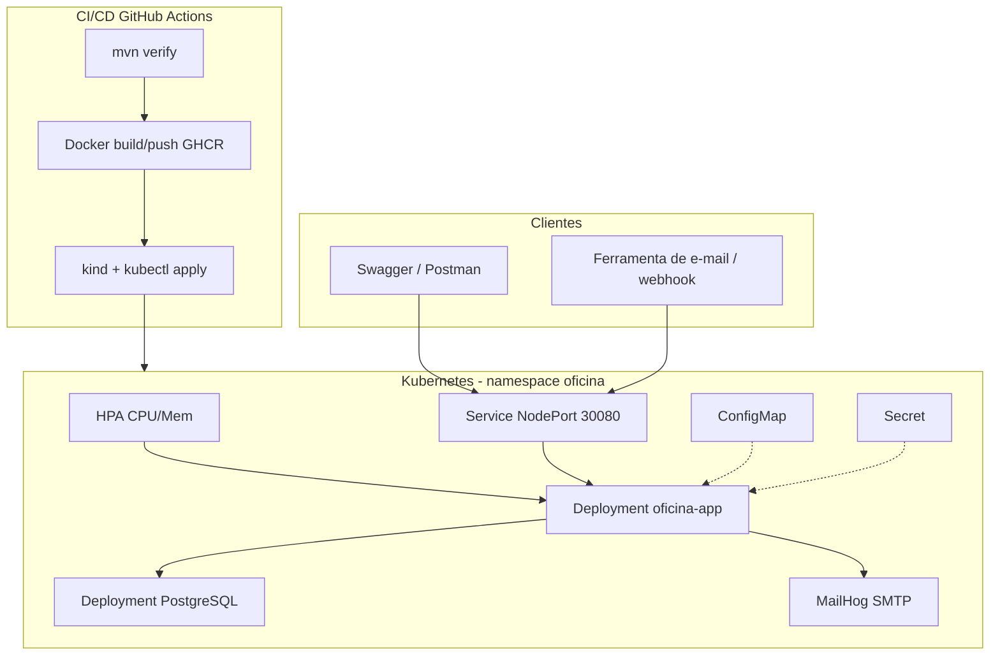

# Oficina Mecânica — Tech Challenge Fase 2 (14SOAT)

Back-end para gestão de ordens de serviço, clientes, veículos, catálogo e métricas, evoluído na **Fase 2** com foco em qualidade, resiliência, containerização, Kubernetes, IaC (Terraform) e CI/CD.

---

## Objetivos desta fase

- Reduzir riscos operacionais com infraestrutura escalável (K8s + HPA)
- Automatizar provisionamento (Terraform) e deploy (GitHub Actions)
- Manter evolução sustentável (arquitetura em camadas/hexagonal + testes)
- Suportar picos de demanda com escalabilidade dinâmica

---

## Arquitetura proposta



### Componentes da aplicação (hexagonal / ports & adapters)

| Camada | Pacotes | Responsabilidade |
|---|---|---|
| Domínio | `entity`, `exception`, `validation` | Regras e modelo de negócio (OS, estoque, transições) |
| Aplicação | `service`, `application.port.out` | Casos de uso; portas de saída (ex.: `NotificacaoPort`) |
| Adaptadores de entrada | `controller`, `dto` | REST / OpenAPI |
| Adaptadores de saída | `repository`, `adapter.out.mail` | JPA/Postgres, e-mail SMTP |
| Configuração | `config` | Security JWT, OpenAPI, wiring Spring |

Classe de entrada: `OficinaApplication`.

### Infraestrutura provisionada

| Recurso | Onde | Descrição |
|---|---|---|
| Cluster K8s | Terraform (`infra/`) + Kind | Cluster local com NodePort 30080 |
| Banco | `k8s/postgres.yaml` | PostgreSQL 16 + PVC; schema via Flyway na API |
| API | `k8s/app.yaml` | Deployment (2 réplicas), Service, HPA |
| Config | `k8s/configmap.yaml` + `secret.yaml` | Variáveis e segredos (JWT, senhas, token e-mail) |
| E-mail | MailHog (Compose profile `tools` / K8s) | Visualização de notificações de status |

### Fluxo de deploy

1. **CI**: `mvn verify` (build + testes)
2. **Imagem**: build Docker → push GHCR (`ghcr.io/<owner>/oficina-mecanica`)
3. **CD**: sobe Kind → aplica Postgres → aplica App/HPA/MailHog
4. Flyway migra o banco no startup da aplicação

---

## Stack tecnológica

| Tecnologia | Versão | Uso |
|---|---|---|
| Java | 17 | Runtime |
| Spring Boot | 3.2.5 | Framework |
| PostgreSQL | 16 | Banco |
| Flyway | (Boot) | Migrações |
| Spring Security + JWT | jjwt 0.12.x | API stateless |
| Spring Mail + MailHog | — | Notificação / atualização de status via e-mail |
| Kubernetes | Kind / manifests em `/k8s` | Orquestração + HPA |
| Terraform | ≥ 1.5 | Provisionamento do cluster + apply |
| GitHub Actions | `.github/workflows/ci-cd.yml` | CI/CD |
| SpringDoc OpenAPI | 2.5 | Swagger |
| Testcontainers | 1.19.x | Testes com Postgres |

---

## Pré-requisitos

- **Java 17+**, **Maven 3.9+**, **Docker Desktop** ativo
- Para K8s local: **kubectl**, **kind**, **Terraform ≥ 1.5**

---

## Execução local (Docker Compose)

```bash
docker compose up --build -d
```

Com ferramentas de e-mail e PgAdmin:

```bash
docker compose --profile tools up --build -d
```

- API: http://localhost:8080/api  
- Health: http://localhost:8080/api/actuator/health  
- Swagger: http://localhost:8080/api/swagger-ui.html  
- MailHog UI: http://localhost:8025  

```bash
copy .env.example .env
docker compose logs -f app
```

### App local + só Postgres

```bash
docker compose up -d postgres
docker compose --profile tools up -d mailhog
mvn spring-boot:run -Dspring-boot.run.profiles=dev
```

---

## Deploy em Kubernetes

### Opção A — script (Windows PowerShell)

```powershell
docker build -t oficina-mecanica:local .
kind create cluster --name oficina-k8s --config - <<'EOF'
# ou use Terraform (Opção B)
EOF
.\infra\apply-k8s.ps1 -Image "oficina-mecanica:local" -ClusterName "oficina-k8s"
```

Se o cluster ainda não existir, use a Opção B (Terraform cria o Kind com o NodePort mapeado).

### Opção B — Terraform (recomendado)

```bash
docker build -t oficina-mecanica:local .
cd infra
terraform init
terraform apply
```

No Windows, se o `local-exec` do apply falhar no shell, após o cluster criado:

```powershell
.\infra\apply-k8s.ps1
```

API no Kind: **http://localhost:30080/api**

```bash
kubectl -n oficina get deploy,svc,hpa,pods
kubectl -n oficina logs -f deploy/oficina-app
```

Escalar / observar HPA (demo de carga):

```bash
kubectl -n oficina autoscale deployment oficina-app --cpu-percent=50 --min=2 --max=6
# ou use o HPA já declarado em k8s/app.yaml
kubectl -n oficina get hpa -w
```

---

## Provisionamento com Terraform (`/infra`)

Recursos criados (ver `terraform output recursos_criados`):

1. Cluster **Kind** (`oficina-k8s`) com mapeamento do NodePort **30080**
2. Load da imagem Docker no nó Kind
3. Apply dos manifestos em `/k8s` (namespace, ConfigMap, Secret, Postgres, App, HPA, MailHog)

Destruir:

```bash
cd infra
terraform destroy
```

Detalhes: [`infra/README.md`](infra/README.md).

---

## APIs de Ordem de Serviço (Fase 2)

Base: **http://localhost:8080/api** (Compose) ou **http://localhost:30080/api** (Kind).

| Método | Caminho | Descrição |
|---|---|---|
| POST | `/ordens-servico` | Abertura de OS (cliente, veículo, serviços, peças) → retorna id/número |
| GET | `/ordens-servico/{numero}/acompanhamento` | Consulta de status (público) |
| POST | `/ordens-servico/{numero}/orcamento/notificacao` | Notificação externa **APROVADO** / **RECUSADO** |
| GET | `/ordens-servico` | Listagem: prioridade Execução > Aguardando > Diagnóstico > Recebida; mais antigas primeiro; **sem** FINALIZADA/ENTREGUE |
| POST | `/ordens-servico/email/atualizar-status` | Atualização de status via ferramenta de e-mail (token) |

Collection / contrato interativo: **Swagger UI** → http://localhost:8080/api/swagger-ui.html  
OpenAPI JSON: http://localhost:8080/api/v3/api-docs  

### Login seed

```json
POST /api/auth/login
{ "email": "admin@oficina.com", "senha": "Admin@123" }
```

### Exemplo — notificação de orçamento

```json
POST /api/ordens-servico/1/orcamento/notificacao
{
  "decisao": "APROVADO",
  "documentoCliente": "39053344705",
  "observacao": "Aprovado pelo app do cliente"
}
```

### Exemplo — status via e-mail

```json
POST /api/ordens-servico/email/atualizar-status
{
  "numero": 1,
  "novoStatus": "EM_DIAGNOSTICO",
  "token": "oficina-email-status-token",
  "observacao": "Clique no link do e-mail"
}
```

Após mudanças de status, confira a mensagem no **MailHog** (http://localhost:8025).

---

## Testes

```bash
mvn test
mvn test jacoco:report
```

Abrir: `target/site/jacoco/index.html`. Testcontainers exige Docker.

---

## Vídeo demonstrativo

Roteiro completo (tempo a tempo, comandos e payloads): [`docs/roteiro-video.md`](docs/roteiro-video.md)  
Diagramas para o PDF/vídeo: [`docs/diagrama-arquitetura.md`](docs/diagrama-arquitetura.md)

> **TODO (entrega):** gravar com o roteiro, publicar no YouTube/Vimeo (até 15 min) e colar o link abaixo.

- Link do vídeo: _pending_

---

## Entrega no portal

PDF com:

1. Link do repositório GitHub compartilhado com o usuário **`soat-architecture`**
2. Desenho da arquitetura (diagrama deste README)
3. Link do vídeo demonstrativo

---

## Banco (DBeaver)

| Campo | Valor |
|---|---|
| Host | `localhost` |
| Porta | `5432` |
| Banco | `oficina_mecanica` |
| Usuário | `oficina` |
| Senha | `oficina123` |

---

## Variáveis relevantes

| Variável | Padrão | Descrição |
|---|---|---|
| `DB_URL` / `DB_USERNAME` / `DB_PASSWORD` | ver Compose | JDBC |
| `JWT_SECRET` | — | Mín. 32 caracteres em produção |
| `MAIL_HOST` / `MAIL_PORT` | localhost:1025 | SMTP (MailHog) |
| `MAIL_ENABLED` | true | Liga/desliga envio |
| `MAIL_STATUS_TOKEN` | `oficina-email-status-token` | Token do endpoint via e-mail |

---

## Licença

Projeto privado — todos os direitos reservados.
