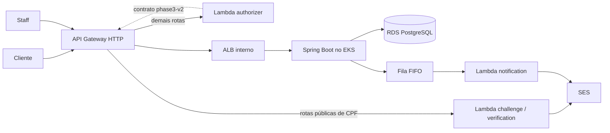

# Oficina Mecânica — Tech Challenge Fase 3 (15SOAT)

Sistema de atendimento e execução de serviços de uma oficina mecânica de médio porte, rodando em nuvem gerenciada na AWS.

A Fase 2 entregou a aplicação em Kubernetes local. A Fase 3 move o sistema para AWS: API Gateway como única superfície pública, EKS e RDS privados, autenticação de cliente em funções Lambda, infraestrutura em Terraform distribuída por quatro repositórios com CI/CD independentes, e observabilidade completa.

**O ambiente de staging está no ar e verificado.** Produção permanece desligada por padrão, atrás de gates explícitos.

---

## Arquitetura



O API Gateway é o único endereço público. O cluster fica atrás de um ALB interno e o banco não tem endereço público.

A autorização não está espalhada pelo código: é um contrato de rotas versionado, o `phase3-v2`, **default-deny** — rota sem concessão explícita é recusada. Ele é aplicado duas vezes: o gateway vincula cada rota ao authorizer, e o authorizer reaplica o mesmo contrato do lado servidor.

Diagramas detalhados: [componentes](docs/phase-3/architecture/components.md) · [sequência de autenticação](docs/phase-3/architecture/authentication-sequence.md) · [abertura e entrega da OS](docs/phase-3/architecture/order-opening-sequence.md) · [modelo ER](docs/phase-3/architecture/data-model.md).

### Componentes implantados

| Componente | Identidade |
|---|---|
| Kubernetes | EKS `oficina-phase3`, versão 1.35, dois node groups gerenciados |
| Workload | `oficina-app` no namespace `oficina-staging`, atrás de target group do ALB interno |
| Escala | HorizontalPodAutoscaler, 1 a 2 réplicas, alvo de 60% de CPU |
| Banco | RDS PostgreSQL 16.15, privado, schema na versão 8 do Flyway |
| Serverless | Lambdas `challenge`, `verification`, `authorizer` e `notification` |
| Observabilidade | New Relic: 4 dashboards, 14 condições de alerta, 1 monitor sintético |

---

## Quatro repositórios

Cada repositório tem pipeline próprio e é dono de um estado Terraform distinto; nenhum recurso é gerenciado por dois estados.

| Repositório | Responsável por | Deploy |
|---|---|---|
| [APP](https://github.com/rafaelxvr/Tech-challenge-15SOAT) (este) | aplicação Spring Boot, migrações, imagem, manifests de workload | imagem no ECR + rollout no EKS |
| [K8S](https://github.com/rafaelxvr/Tech-challenge-15SOAT-k8s-infra) | rede, EKS, add-ons, ALB interno, casca do gateway, monitoramento | `terraform apply` por ambiente |
| [FUN](https://github.com/rafaelxvr/Tech-challenge-15SOAT-functions) | Lambdas, authorizer, rotas públicas de CPF, IAM das funções | `terraform apply` + código das funções |
| [DB](https://github.com/rafaelxvr/Tech-challenge-15SOAT-db-infra) | RDS, regras de rede, backup, referências de credencial | `terraform apply` por ambiente |

Arquitetura por repositório: [APP](docs/architecture.md) · [índice da Fase 3](docs/phase-3/README.md).

---

## Autenticação

Duas identidades independentes chegam ao mesmo gateway.

**Cliente, por CPF.** `POST /api/auth/cpf/desafios` localiza o cliente, guarda o hash de um código de uso único e o envia por e-mail via SES. `POST /api/auth/cpf/verificar` troca o código por um token **RS256** com `principal_type: customer` e escopos restritos ao próprio pedido (`orders:read:self`, `orders:decide:self`). O desafio expira em 5 minutos; o token vale 15 minutos e não tem refresh.

**Staff, por credencial.** `POST /api/auth/login` devolve um token **HS256** com o papel do operador.

Ambas as rotas de emissão são anônimas no gateway. Todas as outras passam pelo authorizer.

---

## Ambiente de staging

Endereço público: `https://qcm8l43flb.execute-api.us-east-1.amazonaws.com`

```bash
BASE=https://qcm8l43flb.execute-api.us-east-1.amazonaws.com

curl -s $BASE/health                                              # 200
curl -s -o /dev/null -w '%{http_code}\n' $BASE/api/clientes       # 401, anônimo
curl -s -o /dev/null -w '%{http_code}\n' $BASE/api/clientes \
  -H 'Authorization: Bearer invalido'                             # 401
```

O stage aceita **1 requisição por segundo** (burst 2); rajadas recebem `429`.

Detalhes verificados do ambiente: [live environment](docs/phase-3/evidence/live-environment.md).

---

## CI/CD

Push em `develop` dispara `APP staging rollout`: testa o commit, constrói a imagem, publica no ECR com tag imutável `staging-<sha>-<timestamp>`, atualiza o Deployment, espera a nova revisão ficar saudável e só então verifica o health público. Falha em qualquer etapa reverte o Deployment para a revisão anterior.

A autenticação dos pipelines na AWS é por **OIDC**, com credenciais de curta duração; a role de deploy confia no repositório exato por owner e repo imutáveis. Nenhuma chave estática é guardada no GitHub.

O Deployment registra a origem do que está rodando:

```bash
kubectl get deployment oficina-app -n oficina-staging \
  -o jsonpath='{.metadata.annotations.oficina\.io/released-commit}'
```

Produção roda só em `main`, condicionada a `vars.APP_PRODUCTION_DEPLOYMENT_ENABLED == 'true'` e ao ambiente protegido `production`. Os gates ficam desligados por padrão; `develop` continua exclusivo de staging. Ver [contrato de promoção](docs/phase-3/app-production-promotion-contract.md).

---

## Observabilidade

Dashboards, condições de alerta e monitor sintético são recursos Terraform no repositório K8S — nenhum montado à mão.

| Dashboard | Cobre |
|---|---|
| `Oficina Phase 3 Platform` | latência p95, capacidade do Kubernetes, heartbeat de telemetria, logs correlacionados |
| `Oficina Phase 3 Business` | duração média por status |
| `Oficina Phase 3 Orders` | volume de ordens e idade por status |
| `Oficina Phase 3 Delivery` | outbox bloqueado, falhas de entrega e de integração |

As 14 condições de alerta ficam na policy `Oficina Phase 3 <ambiente> operations`. Os logs da aplicação são JSON estruturado e cada resposta carrega `X-Correlation-Id`, que liga a requisição ao trace distribuído.

---

## Documentação canônica

`docs/` guarda apenas documentação canônica. Material de planejamento e roteiros de gravação ficam fora do repositório.

- [Índice da Fase 3](docs/phase-3/README.md) — arquitetura, runbooks, evidências
- [Arquitetura da APP](docs/architecture.md)
- [Matriz requisito/evidência](docs/phase-3/evidence/requirements.md)
- [Contratos de API](docs/phase-3/api/contracts.md) — snapshots OpenAPI e Postman com hash
- [RFCs](docs/rfcs/001-aws-profile.md) e [ADRs](docs/adrs/001-modular-monolith.md)
- [Guia de submissão](docs/phase-3/submission/README.md)

---

## Execução local

```bash
docker compose up --build -d
```

Com ferramentas de e-mail e PgAdmin:

```bash
docker compose --profile tools up --build -d
```

- API: http://localhost:8080/api
- Health: http://localhost:8080/api/actuator/health
- Swagger: http://localhost:8080/api/swagger-ui.html
- MailHog: http://localhost:8025

Apenas a aplicação, com Postgres em container:

```bash
docker compose up -d postgres
docker compose --profile tools up -d mailhog
./mvnw spring-boot:run -Dspring-boot.run.profiles=dev
```

### Pré-requisitos

Java 17 e Docker Desktop ativo; o Maven vem pelo wrapper. Versões e checksums reproduzíveis em [`toolchain.lock.json`](toolchain.lock.json).

```powershell
$env:JAVA_HOME = 'C:\Program Files\Eclipse Adoptium\jdk-17.0.20.101-hotspot'
$env:PATH = "$env:JAVA_HOME\bin;$env:PATH"
.\scripts\check-toolchain.ps1
.\mvnw.cmd -B verify
```

---

## Stack

| Tecnologia | Versão | Uso |
|---|---|---|
| Java | 17 | Runtime |
| Spring Boot | 3.2.5 | Framework |
| PostgreSQL | 16 | Banco (RDS 16.15 em nuvem) |
| Flyway | (Boot) | Migrações |
| Spring Security + JWT | jjwt 0.12.x | API stateless, HS256 staff e RS256 cliente |
| Kubernetes | EKS 1.35 | Orquestração + HPA |
| Terraform | 1.15.8 | Provisionamento |
| GitHub Actions | `.github/workflows/` | CI/CD com OIDC |
| SpringDoc OpenAPI | 2.5 | Swagger |
| Testcontainers | 1.19.x | Testes com Postgres |

---

## APIs de Ordem de Serviço

Base: `https://qcm8l43flb.execute-api.us-east-1.amazonaws.com/api` (staging) ou `http://localhost:8080/api` (local).

| Método | Caminho | Autorização |
|---|---|---|
| POST / GET | `/ordens-servico` | Staff ADMIN/MECANICO: abertura e listagem operacional |
| GET | `/ordens-servico/{numero}/acompanhamento` | Customer, `orders:read:self`, própria OS |
| POST | `/ordens-servico/{numero}/orcamento/decisao` | Customer, `orders:decide:self`, própria OS |
| POST | `/ordens-servico/{numero}/aprovar` | Alias autenticado de aprovação; documento deve concordar com o cliente do JWT |
| POST | `/ordens-servico/{numero}/orcamento/notificacao` | Alias autenticado de decisão; documento deve concordar com o cliente do JWT |

Use o **número retornado pela criação da OS**, não um número fixo. Ordem inexistente ou de outro cliente retorna 404. A resposta traz valores, itens do orçamento e histórico de status, sem nome, documento, placa, contato, identificadores de atores ou observações internas.

### Exemplo — decisão autenticada

```http
POST /api/ordens-servico/{{osNumero}}/orcamento/decisao
Authorization: Bearer {{customerToken}}
Content-Type: application/json

{
  "decisao": "APROVADO",
  "observacao": "Autorizo este orçamento"
}
```

Para recusar, envie `"decisao": "RECUSADO"`. O corpo canônico não recebe identidade; os aliases legados exigem `documentoCliente` apenas como conferência do cliente já autenticado.

`/ordens-servico/email/atualizar-status` foi removido: retorna 404 inclusive com o antigo token compartilhado, e nunca é exposto no gateway. E-mails são notificações; a decisão exige login do cliente.

Swagger UI em `/api/swagger-ui.html` e OpenAPI em `/api/v3/api-docs` exigem JWT staff.

### Postman

`postman/Oficina-Fase3-Staging.postman_collection.json` cobre o fluxo completo contra o staging, na ordem da demonstração: saúde, login de staff, catálogo, abertura da OS, autenticação por CPF, decisão do cliente, entrega, controles negativos e métricas de negócio. Os scripts encadeiam tokens e identificadores sozinhos.

Importe junto `postman/Oficina-Fase3-Staging.postman_environment.json` e preencha `admin_senha` com a credencial do operador — o arquivo versionado vai vazio de propósito.

---

## Testes

```bash
./mvnw test
./mvnw test jacoco:report          # relatório em target/site/jacoco/index.html
python scripts/check-doc-links.py docs README.md
python scripts/verify-api-snapshots.py
```

Testcontainers exige Docker.

---

## Variáveis relevantes

| Variável | Padrão | Descrição |
|---|---|---|
| `DB_URL` / `DB_USERNAME` / `DB_PASSWORD` | ver Compose | JDBC |
| `JWT_SECRET` | obrigatório | Segredo staff com no mínimo 32 bytes UTF-8 e entropia aleatória. Emissores, audiências, key IDs e chaves públicas também são obrigatórios; ver [confiança JWT](docs/runbooks/jwt-trust.md) |
| `MAIL_HOST` / `MAIL_PORT` | localhost:1025 | SMTP para testes locais com perfil `local-mailhog` |
| `HISTORICO_ZONA_COMPATIBILIDADE` | obrigatório; `UTC` em dados sintéticos novos | Zona comprovada para horários de compatibilidade; ver [primeiro cutover](docs/runbooks/first-writer-cutover.md) |

O `kid` da chave pública do cliente publicado à APP precisa coincidir com o `customer_key_id` configurado nas funções. Divergência faz a APP recusar todo token de cliente com 401, enquanto o authorizer continua aceitando.

---

## Entrega

O PDF de submissão reúne os links dos quatro repositórios, o desenho da arquitetura e o link do vídeo. Processo e checagens em [guia de submissão](docs/phase-3/submission/README.md).

O repositório precisa estar compartilhado com o usuário **`soat-architecture`**.

---

## Fase 2 (histórico)

A entrega anterior, com Kind local, permanece registrada em [`docs/entrega-fase-2.md`](docs/entrega-fase-2.md) e no [PDF](docs/entrega-fase-2.pdf). O [vídeo da Fase 2](https://youtu.be/iAgTYmfNnx0) continua publicado. A topologia descrita ali não é o perfil de nuvem da Fase 3.

---

## Licença

Projeto privado — todos os direitos reservados.
