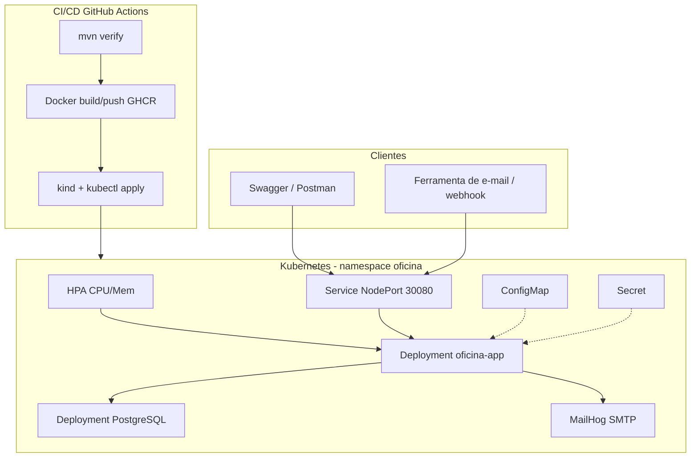

# Oficina Mecânica — Tech Challenge Fase 2 (15SOAT)

Back-end para gestão de ordens de serviço, clientes, veículos, catálogo e métricas, evoluído na **Fase 2** com foco em qualidade, resiliência, containerização, Kubernetes, IaC (Terraform) e CI/CD.

## Fase 3: reviewed architecture

Start with the [APP architecture guide](docs/architecture.md), [requirement/evidence matrix](docs/phase-3/evidence/requirements.md), and [disabled cloud adapter prerequisites](docs/i7-pipeline-contracts.md). The Phase 2 material below remains historical; its topology is not the Phase 3 cloud profile.

The Phase 3 component, authentication, order-delivery, and relational-model evidence is in [the architecture index](docs/phase-3/README.md). Use the committed, credential-free [OpenAPI and Postman snapshots](docs/phase-3/api/contracts.md) for local contract review. They document source revision `7ca6e2948e423ea171c252eddeaca266179bd153`; they do not claim an active cloud endpoint. Run `./mvnw.cmd -q test` locally; the protected-cloud handoff remains an authorized R4 action.

Run `./mvnw.cmd -B verify`, `python scripts/check-doc-links.py docs README.md`, and `python scripts/verify-api-snapshots.py` from this repository root. CI is [`.github/workflows/ci-cd.yml`](.github/workflows/ci-cd.yml): it runs on push and pull request for `main` and `develop`. PR checks have no deployment identity; GHCR publishing is push-only and Kind is explicitly local. Its image/deployment stages require their configured environment and do not make a cloud deployment claim in this document.

The [Phase 3 offline submission guide](docs/phase-3/submission/README.md) includes the 14-minute recording plan, unfilled manifest and local PDF checks. Generated template PDFs remain `NOT_READY / FIXTURE_ONLY`; no video, publication, reviewer access or portal submission is claimed.

---

## Objetivos desta fase

- Reduzir riscos operacionais com infraestrutura escalável (K8s + HPA)
- Automatizar provisionamento (Terraform) e deploy (GitHub Actions)
- Manter evolução sustentável (arquitetura em camadas/hexagonal + testes)
- Suportar picos de demanda com escalabilidade dinâmica

---

## Arquitetura proposta

```
                    ┌─────────────────┐     ┌──────────────────┐
                    │ Swagger/Postman │     │ Webhook / e-mail │
                    └────────┬────────┘     └────────┬─────────┘
                             │                       │
                             └───────────┬───────────┘
                                         ▼
┌────────────────────────────────────────────────────────────────────────┐
│  Kubernetes (namespace oficina)                                        │
│                                                                        │
│   ConfigMap + Secret ──▶  Service :30080 ──▶  oficina-app (2–6 pods) │
│                              ▲                      │                  │
│                              │                      ├──▶ PostgreSQL    │
│                         HPA (CPU/Mem)               └──▶ MailHog SMTP  │
└────────────────────────────────────────────────────────────────────────┘
                                         ▲
                                         │ kubectl apply /k8s
┌────────────────────────────────────────┴───────────────────────────────┐
│  CI/CD (GitHub Actions)                                                │
│   mvn verify  →  Docker build/push GHCR  →  Kind + deploy              │
└────────────────────────────────────────────────────────────────────────┘
                                         ▲
                                         │
                              Terraform (infra/) → Kind cluster
```

Diagramas Mermaid (exportáveis para o PDF) e roteiro do vídeo: [`docs/diagrama-arquitetura.md`](docs/diagrama-arquitetura.md) · [`docs/roteiro-video-demonstracao.md`](docs/roteiro-video-demonstracao.md).

<details>
<summary>Diagrama Mermaid (renderiza no GitHub; no IntelliJ use o plugin Mermaid ou o ASCII acima)</summary>



</details>

### Componentes da aplicação (hexagonal / ports & adapters)

| Camada | Pacotes | Responsabilidade |
|---|---|---|
| Domínio | `entity`, `exception`, `validation` | Regras e modelo de negócio (OS, estoque, transições) |
| Aplicação | `service`, `application.port.out` | Casos de uso; portas de saída (ex.: `NotificacaoPort`) |
| Adaptadores de entrada | `controller`, `dto` | REST / OpenAPI |
| Adaptadores de saída | `repository`, `adapter.out.outbox` | JPA/Postgres e intenção de notificação transacional |
| Configuração | `config` | Security JWT, OpenAPI, wiring Spring |

Classe de entrada: `OficinaApplication`.

### Infraestrutura provisionada

| Recurso | Onde | Descrição |
|---|---|---|
| Cluster K8s | Terraform (`infra/`) + Kind | Cluster local com NodePort 30080 |
| Banco | `k8s/postgres.yaml` | PostgreSQL 16 + PVC; schema via Flyway na API |
| API | `k8s/app.yaml` | Deployment (2 réplicas), Service, HPA |
| Config | `k8s/configmap.yaml` + `secret.yaml` | Variáveis e segredos (JWT, senhas, token e-mail) |
| E-mail local | MailHog (Compose profile `tools`) | Destino de testes do consumidor; ativação explícita com `local-mailhog` |

### Fluxo de deploy

1. **CI**: `mvn verify` (build + testes)
2. **Imagem**: build Docker → push GHCR (`ghcr.io/<owner>/oficina-mecanica`)
3. **CD**: sobe Kind → aplica Postgres → aplica App/HPA/MailHog
4. Flyway migra o banco no startup da aplicação

---

## Stack tecnológica

| Tecnologia | Versão | Uso |
|---|---|---|
| Java | 17 | Runtime |
| Spring Boot | 3.2.5 | Framework |
| PostgreSQL | 16 | Banco |
| Flyway | (Boot) | Migrações |
| Spring Security + JWT | jjwt 0.12.x | API stateless |
| Spring Mail + MailHog | — | Testes locais de entrega após commit |
| Kubernetes | Kind / manifests em `/k8s` | Orquestração + HPA |
| Terraform | 1.15.8 | Provisionamento do cluster + apply |
| GitHub Actions | `.github/workflows/ci-cd.yml` | CI/CD |
| SpringDoc OpenAPI | 2.5 | Swagger |
| Testcontainers | 1.19.x | Testes com Postgres |

---

## Pré-requisitos

- **Java 17**, **Docker Desktop** ativo; Maven 3.9.16 é fornecido pelo wrapper
- Para K8s local: **kubectl**, **Kind 0.33.0**, **Terraform 1.15.8**

Versões e checksums reproduzíveis estão em [`toolchain.lock.json`](toolchain.lock.json). No PowerShell, selecione um JDK 17 para a sessão e valide o ambiente:

```powershell
$env:JAVA_HOME = 'C:\Program Files\Eclipse Adoptium\jdk-17.0.20.101-hotspot'
$env:PATH = "$env:JAVA_HOME\bin;$env:PATH"
.\scripts\check-toolchain.ps1
.\mvnw.cmd -B verify
```

---

## Execução local (Docker Compose)

```bash
docker compose up --build -d
```

Com ferramentas de e-mail e PgAdmin:

```bash
docker compose --profile tools up --build -d
```

- API: http://localhost:8080/api  
- Health: http://localhost:8080/api/actuator/health  
- Swagger: http://localhost:8080/api/swagger-ui.html  
- MailHog UI: http://localhost:8025  

```bash
copy .env.example .env
docker compose logs -f app
```

### App local + só Postgres

```bash
docker compose up -d postgres
docker compose --profile tools up -d mailhog
./mvnw spring-boot:run -Dspring-boot.run.profiles=dev
```

---

## Deploy em Kubernetes

### Opção A — script (Windows PowerShell)

```powershell
docker build -t oficina-mecanica:local .
kind create cluster --name oficina-k8s --config - <<'EOF'
# ou use Terraform (Opção B)
EOF
.\infra\apply-k8s.ps1 -Image "oficina-mecanica:local" -ClusterName "oficina-k8s"
```

Se o cluster ainda não existir, use a Opção B (Terraform cria o Kind com o NodePort mapeado).

### Opção B — Terraform (recomendado)

```bash
docker build -t oficina-mecanica:local .
cd infra
terraform init
terraform apply
```

No Windows, se o `local-exec` do apply falhar no shell, após o cluster criado:

```powershell
.\infra\apply-k8s.ps1
```

API no Kind: **http://localhost:30080/api**

```bash
kubectl -n oficina get deploy,svc,hpa,pods
kubectl -n oficina logs -f deploy/oficina-app
```

Escalar / observar HPA (demo de carga):

```bash
kubectl -n oficina autoscale deployment oficina-app --cpu-percent=50 --min=2 --max=6
# ou use o HPA já declarado em k8s/app.yaml
kubectl -n oficina get hpa -w
```

---

## Provisionamento com Terraform (`/infra`)

Recursos criados (ver `terraform output recursos_criados`):

1. Cluster **Kind** (`oficina-k8s`) com mapeamento do NodePort **30080**
2. Load da imagem Docker no nó Kind
3. Apply dos manifestos em `/k8s` (namespace, ConfigMap, Secret, Postgres, App, HPA, MailHog)

Destruir:

```bash
cd infra
terraform destroy
```

Detalhes: [`infra/README.md`](infra/README.md).

---

## APIs de Ordem de Serviço (Fase 3)

Base: **http://localhost:8080/api** (Compose) ou **http://localhost:30080/api** (Kind).

| Método | Caminho | Autorização |
|---|---|---|
| POST / GET | `/ordens-servico` | Staff ADMIN/MECANICO: abertura e listagem operacional |
| GET | `/ordens-servico/{numero}/acompanhamento` | Customer, `orders:read:self`, própria OS |
| POST | `/ordens-servico/{numero}/orcamento/decisao` | Customer, `orders:decide:self`, própria OS |
| POST | `/ordens-servico/{numero}/aprovar` | Alias autenticado de aprovação; documento deve concordar com o cliente do JWT |
| POST | `/ordens-servico/{numero}/orcamento/notificacao` | Alias autenticado de decisão; documento deve concordar com o cliente do JWT |

Use o **número retornado pela criação da OS**, não um número fixo. Ordem inexistente ou pertencente a outro cliente retorna 404. A resposta inclui valores e itens do orçamento e histórico de status, sem nome, documento, placa, contato, identificadores de atores ou observações internas.

O cliente obtém seu token no fluxo CPF + código de email do gateway. O token customer dura 15 minutos e não tem refresh. O login staff continua em `POST /api/auth/login`; ele não autentica o cliente. Tokens anteriores à atualização exigem **novo login**. Veja [migração das operações de cliente](docs/runbooks/customer-order-access.md).

### Exemplo — decisão autenticada

```http
POST /api/ordens-servico/{{osNumero}}/orcamento/decisao
Authorization: Bearer {{customerToken}}
Content-Type: application/json

{
  "decisao": "APROVADO",
  "observacao": "Autorizo este orçamento"
}
```

Para recusar, envie `"decisao": "RECUSADO"`. O corpo canônico não recebe identidade. Os aliases legados exigem `documentoCliente`, apenas como conferência do cliente já autenticado.

`/ordens-servico/email/atualizar-status` foi removido: retorna 404 inclusive com o antigo token compartilhado e não executa serviços. Emails são notificações; a decisão exige login do cliente. A variável `MAIL_STATUS_TOKEN` não é mais consumida pela aplicação.

Swagger UI em `/api/swagger-ui.html` e OpenAPI em `/api/v3/api-docs` exigem JWT staff. Somente `POST /api/auth/login` e `GET /api/actuator/health` permitem acesso anônimo na APP. O fluxo CPF do gateway pertence ao serviço de autenticação separado.

---

## Testes

```bash
./mvnw test
./mvnw test jacoco:report
```

Abrir: `target/site/jacoco/index.html`. Testcontainers exige Docker.

---

## Vídeo demonstrativo

Roteiro completo (tempo a tempo, comandos e payloads): [`docs/roteiro-video-demonstracao.md`](docs/roteiro-video-demonstracao.md)
Diagramas para o PDF/vídeo: [`docs/diagrama-arquitetura.md`](docs/diagrama-arquitetura.md)

Vídeo publicado no YouTube, conforme o roteiro de demonstração:

- [Assistir ao vídeo demonstrativo](https://youtu.be/iAgTYmfNnx0)

---

## Entrega no portal

Documentos finais:

- [Fonte Markdown da entrega](docs/entrega-fase-2.md)
- [PDF para o portal do aluno](docs/entrega-fase-2.pdf)

O PDF contém:

1. Link do repositório GitHub compartilhado com o usuário **`soat-architecture`**
2. Desenho da arquitetura (diagrama deste README)
3. Link do vídeo demonstrativo

---

## Banco (DBeaver)

| Campo | Valor |
|---|---|
| Host | `localhost` |
| Porta | `5432` |
| Banco | `oficina_mecanica` |
| Usuário | `oficina` |
| Senha | `oficina123` |

---

## Variáveis relevantes

| Variável | Padrão | Descrição |
|---|---|---|
| `DB_URL` / `DB_USERNAME` / `DB_PASSWORD` | ver Compose | JDBC |
| `JWT_SECRET` | Obrigatório | Segredo staff com pelo menos 32 bytes UTF-8 e entropia aleatória; emissores, audiências, IDs e chaves públicas também são obrigatórios. Veja [configuração de confiança JWT](docs/runbooks/jwt-trust.md). |
| `MAIL_HOST` / `MAIL_PORT` | localhost:1025 | SMTP para testes do consumidor com perfil `local-mailhog` |
| `MAIL_ENABLED` | legado | Não seleciona mais a notificação; toda transição grava no [outbox transacional](docs/runbooks/transactional-notifications.md) |
| `HISTORICO_ZONA_COMPATIBILIDADE` | obrigatório; `UTC` nos dados sintéticos novos | Zona comprovada para horários de compatibilidade; veja [primeiro cutover](docs/runbooks/first-writer-cutover.md) |

---

## Licença

Projeto privado — todos os direitos reservados.
# Phase 3 documentation

See [architecture and operations](docs/phase-3/README.md). The repository records reviewed source artifacts; no cloud deployment is represented as active.
