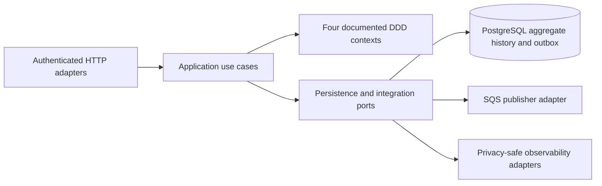

# APP architecture guide

The [Phase 3 index](phase-3/README.md) describes reviewed source, with [requirements and acceptance gaps](phase-3/evidence/requirements.md). It does not establish a deployed environment. Historical Phase 2 diagrams and demonstrations remain preserved under their existing titles.

The four documented contexts remain identity/access, workshop orders, catalog, and reporting/delivery. Atomic order/history/outbox changes justify the [modular monolith ADR](adrs/001-modular-monolith.md); deployment repositories do not become new business contexts. PostgreSQL owns reporting truth; DynamoDB belongs to FUN's temporary challenge and delivery coordination. See the [relational rationale](rfcs/002-postgresql-model.md) and [data model](phase-3/architecture/data-model.md).

Technologies: Java 17, Spring Boot 3.2.5, PostgreSQL 16, Flyway, Maven, JWT RS256 customer/HS256 staff trust and ports/adapters. Prerequisites: JDK 17, Docker for Testcontainers, Maven wrapper, Python 3 for documentation and PowerShell 7 for pipeline contracts.

From this root run `./mvnw.cmd -B verify`, `pwsh -File tests/pipeline-contract.ps1`, `python scripts/check-doc-links.py docs README.md` and `python scripts/verify-api-snapshots.py`. On Linux use `./mvnw`. The [API snapshots](phase-3/api/contracts.md) identify their immutable revision and are not regenerated release exports.

The [release runbook](phase-3/runbooks/release-operations.md) covers cutover, compatible rollback, key rotation and inspected recovery. The [I6 cutover adapter](runbooks/first-writer-cutover.md) defines offline-tested drain/migration/immutable rollout sequencing and its bootstrap prerequisites. [I7 prerequisites](i7-pipeline-contracts.md) explain why APP cloud adapters remain disabled. The existing [Dockerfile](../Dockerfile) and Kind path are packaging/local-rehearsal assets; no cloud outcome is inferred from them.
