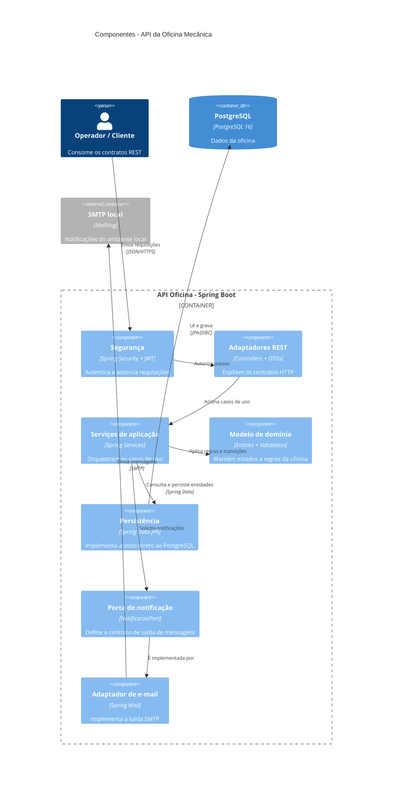

# C4 — Componentes da API

## Leitura

A organização combina arquitetura em camadas com Ports & Adapters na integração de notificação. A persistência continua acoplada às interfaces Spring Data e não é apresentada como uma porta hexagonal completa.
