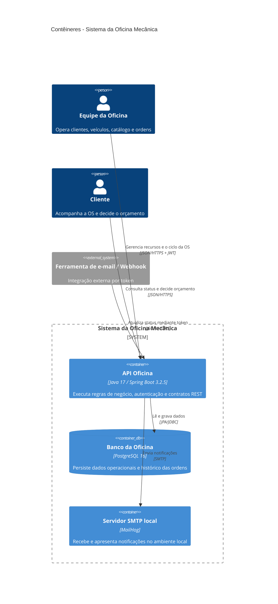

# C4 — Contêineres

## Leitura

A solução é implantada como uma API stateless, um banco PostgreSQL e um SMTP local. Swagger integra a própria API e, por isso, não é modelado como contêiner independente.
