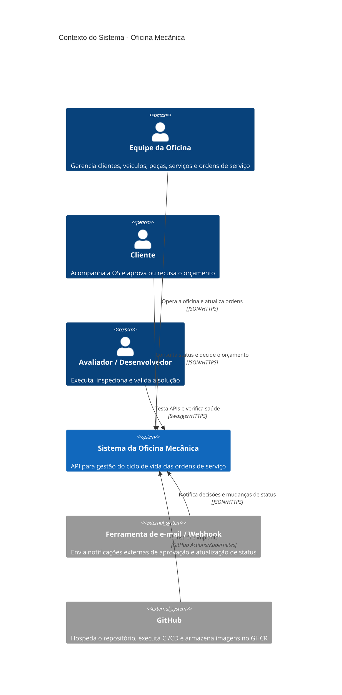

# C4 — Contexto do sistema

## Leitura

O sistema centraliza os fluxos operacionais da oficina e expõe contratos REST para operadores, clientes e integrações externas. O GitHub participa do ciclo de entrega, mas não do domínio de negócio.
