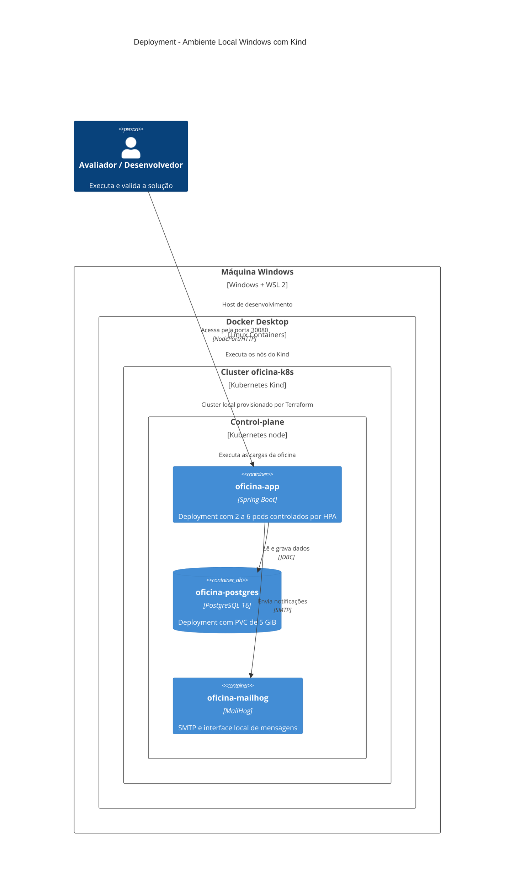

# C4 — Deployment local com Kind

## Leitura

O ambiente é local e reproduzível. ConfigMap e Secret alimentam o Deployment da API; Service NodePort expõe a porta 30080; o HPA ajusta as réplicas quando o Metrics Server fornece métricas.
