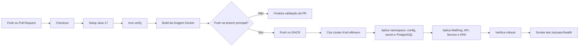

# Fluxo de CI/CD

## Leitura

O pipeline separa CI, construção de imagem e deploy. Pull requests executam build e testes; pushes na branch principal publicam a imagem e validam o deployment em um cluster Kind efêmero.
