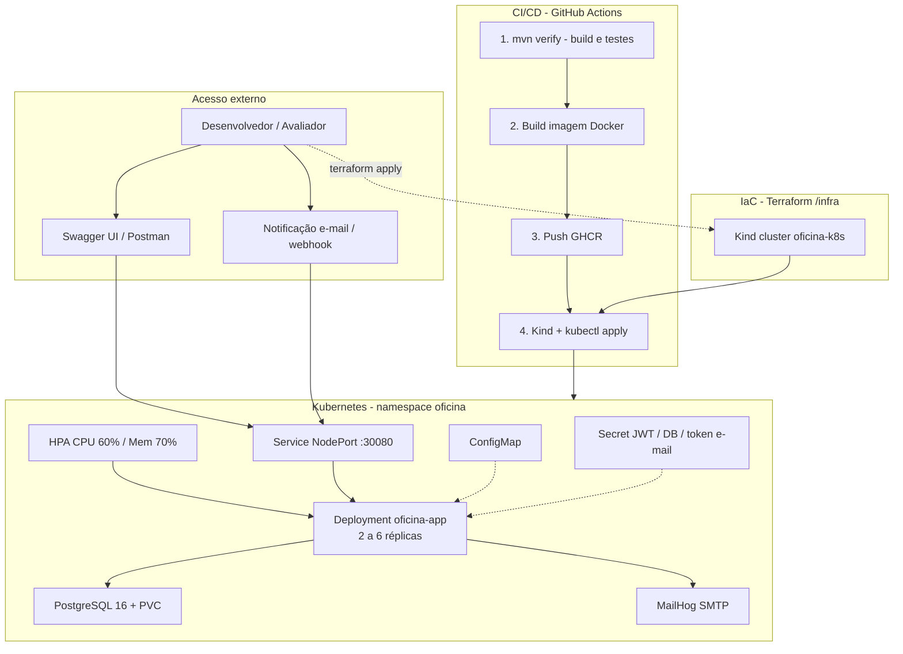
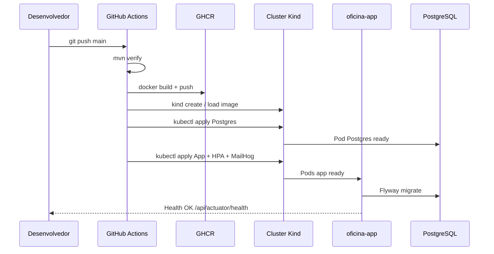
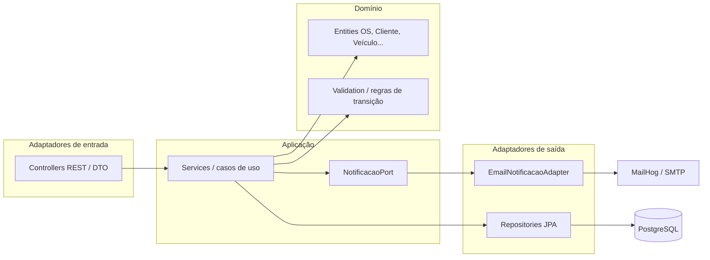
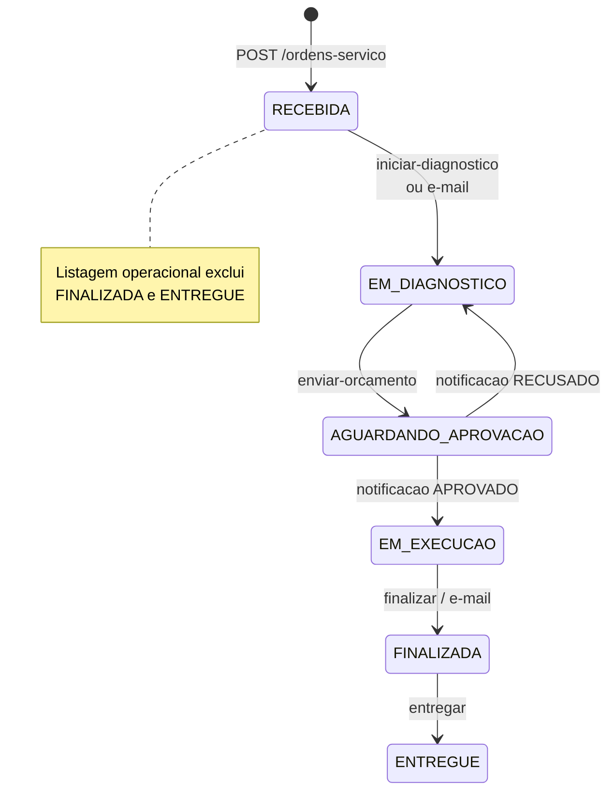

## 1. Visão geral da solução

**Legenda rápida**

| Elemento | Função |
|---|---|
| Terraform + Kind | Provisiona o cluster local |
| GitHub Actions | Automatiza build, testes, imagem e deploy |
| App + HPA | Escalabilidade dinâmica sob carga |
| Postgres + Flyway | Persistência e migração de schema |
| MailHog | Visualiza e-mails de atualização de status |
| ConfigMap / Secret | Separação de config e dados sensíveis |

---

## 2. Fluxo de deploy

---

## 3. Arquitetura da aplicação (hexagonal)

---

## 4. Fluxo de negócio — Ordem de Serviço

**Prioridade na listagem:** Em Execução → Aguardando Aprovação → Diagnóstico → Recebida (mais antigas primeiro).

---