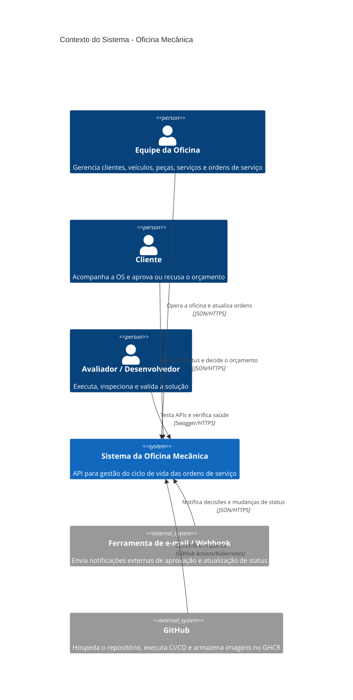
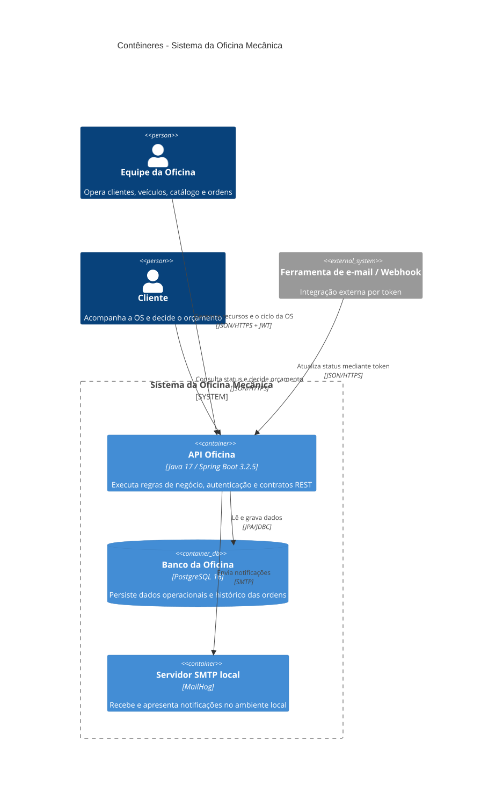
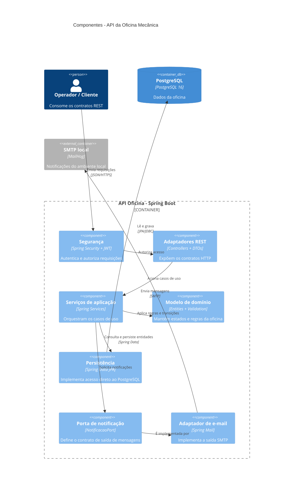
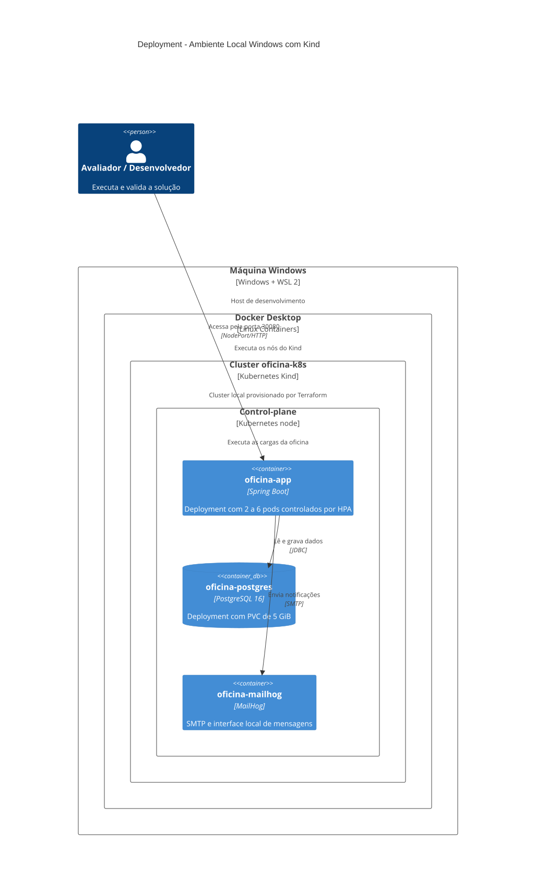

<div class="cover">

# Tech Challenge — Fase 2

## Evolução da Plataforma de Gestão de Oficina Mecânica

**Turma:** 2026.1<br>
**Integrantes:**<br>
Rafael Xavier — RM371756<br>
Silas Furini — RM374087<br>
**Data:** 14/07/2026

**Repositório:**<br>
<https://github.com/SilasFurini/Tech-challenge-15SOAT>

**Vídeo demonstrativo:**<br>
<https://youtu.be/iAgTYmfNnx0>

</div>

<div class="page-break"></div>

## Sumário

1. [Resumo executivo](#1-resumo-executivo)
2. [Problema, objetivos e escopo](#2-problema-objetivos-e-escopo)
3. [Arquitetura da solução](#3-arquitetura-da-solução)
4. [Evolução da aplicação e APIs](#4-evolução-da-aplicação-e-apis)
5. [Containerização](#5-containerização)
6. [Kubernetes e escalabilidade](#6-kubernetes-e-escalabilidade)
7. [Infraestrutura como Código](#7-infraestrutura-como-código)
8. [Pipeline CI/CD](#8-pipeline-cicd)
9. [Qualidade, segurança e resiliência](#9-qualidade-segurança-e-resiliência)
10. [Execução, contratos e entregáveis](#10-execução-contratos-e-entregáveis)
11. [Limitações e evoluções possíveis](#11-limitações-e-evoluções-possíveis)
12. [Apêndices técnicos](#12-apêndices-técnicos)

## 1. Resumo executivo

A solução evolui o sistema de gestão da oficina mecânica criado na Fase 1 para um ambiente automatizado, reproduzível e preparado para escalabilidade horizontal. A aplicação continua concentrando o domínio de clientes, veículos, peças, serviços e ordens de serviço, mas passa a incorporar containerização, orquestração Kubernetes, provisionamento com Terraform e pipeline de integração e entrega contínuas.

O backend é implementado em Java 17 e Spring Boot, utiliza PostgreSQL para persistência e Flyway para evolução do schema. No ambiente local, Docker Compose fornece a aplicação e seus serviços auxiliares. No ambiente orquestrado, um cluster Kind executa a API, o banco e o MailHog, enquanto o Horizontal Pod Autoscaler ajusta a quantidade de réplicas da aplicação entre 2 e 6 pods conforme CPU e memória.

O GitHub Actions automatiza build, testes, criação e publicação da imagem Docker, aplicação dos manifests Kubernetes e smoke test. A documentação dos contratos é disponibilizada em OpenAPI e em uma collection Postman versionada.

### 1.1 Matriz de rastreabilidade

| Requisito | Evidência no repositório | Situação |
|---|---|---|
| Clean Code e organização arquitetural | `src/main/java/com/oficina` e Seção 3 | Atendido |
| Testes automatizados | `src/test/java` e `pom.xml` | Atendido |
| APIs obrigatórias de OS | `OrdemServicoController` e `docs/openapi.yaml` | Atendido |
| Dockerfile e Docker Compose | `Dockerfile` e `docker-compose.yml` | Atendido |
| Deployments, Services, ConfigMap e Secret | `k8s/*.yaml` | Atendido |
| HPA por CPU e memória | `k8s/app.yaml` | Atendido |
| Cluster e banco via IaC | `infra/main.tf` e manifests Kubernetes | Atendido |
| Pipeline de build, testes, imagem e deploy | `.github/workflows/ci-cd.yml` | Atendido |
| Arquitetura, infraestrutura e fluxo de deploy | Seções 3, 6, 7 e 8 | Atendido |
| Execução local, Kubernetes e Terraform | Seção 10 e `README.md` | Atendido |
| Contratos completos das APIs | `docs/openapi.yaml` e `postman/` | Atendido |
| Link do repositório | Capa e Seção 10 | Atendido |
| Link do vídeo | Capa e Seção 10 | A preencher |

<div class="page-break"></div>

## 2. Problema, objetivos e escopo

### 2.1 Problema

O crescimento da demanda e a expansão da oficina aumentam o risco de indisponibilidade, operações manuais e degradação do atendimento em horários de pico. Uma aplicação executada como instância única e implantada manualmente dificulta a repetibilidade do ambiente, a recuperação de falhas e o aumento dinâmico de capacidade.

### 2.2 Objetivos da Fase 2

- Reduzir riscos operacionais com infraestrutura reproduzível e escalável.
- Automatizar provisionamento, testes, construção de imagem e deploy.
- Organizar o código para permitir evolução sustentável.
- Cobrir fluxos críticos com testes automatizados.
- Atender picos de ordens de serviço por meio de escalabilidade horizontal.
- Documentar execução, arquitetura, contratos e decisões relevantes.

### 2.3 Escopo entregue

O escopo contempla a evolução da API, PostgreSQL, notificações por e-mail local, Docker, Kubernetes local com Kind, HPA, Terraform e GitHub Actions. O ambiente foi desenhado para demonstração e validação acadêmica local; recursos gerenciados de nuvem não fazem parte do estado atual.

### 2.4 Vocabulário do domínio

| Termo | Definição usada no projeto |
|---|---|
| Ordem de Serviço (OS) | Registro que reúne cliente, veículo, itens de serviço, peças, orçamento, status e histórico. |
| Diagnóstico | Etapa em que a oficina avalia o veículo e prepara o orçamento. |
| Orçamento | Valor apresentado ao cliente antes do início da execução. |
| Aprovação | Decisão externa que autoriza a execução dos serviços orçados. |
| Execução | Etapa em que os serviços aprovados são realizados. |
| Finalização | Conclusão técnica dos serviços, anterior à entrega do veículo. |
| Entrega | Encerramento operacional da OS com devolução do veículo ao cliente. |

## 3. Arquitetura da solução

### 3.1 Estilo arquitetural

A aplicação adota **arquitetura em camadas com elementos de Ports & Adapters**. Controllers e DTOs formam os adaptadores de entrada REST; serviços coordenam casos de uso; entidades e validadores concentram regras do domínio; repositórios Spring Data implementam persistência; e a notificação é abstraída pela porta `NotificacaoPort`, implementada pelo adaptador SMTP.

Essa denominação reflete o código atual: a saída de notificação está desacoplada por uma porta, enquanto os serviços de aplicação ainda dependem diretamente das interfaces Spring Data. Portanto, o documento não caracteriza a persistência como uma implementação hexagonal completa.

### 3.2 Contexto do sistema



Fonte: [`architecture/c4-context.md`](architecture/c4-context.md).

O sistema atende operadores da oficina, clientes e avaliadores/desenvolvedores. Uma ferramenta externa pode notificar aprovações e mudanças de status. O GitHub hospeda o código, executa o pipeline e armazena imagens no GitHub Container Registry.

### 3.3 Contêineres lógicos



Fonte: [`architecture/c4-containers.md`](architecture/c4-containers.md).

| Contêiner | Tecnologia | Responsabilidade |
|---|---|---|
| API Oficina | Java 17 e Spring Boot 3.2.5 | Contratos REST, autenticação, casos de uso e regras de negócio |
| Banco da Oficina | PostgreSQL 16 | Dados operacionais, catálogo, estoque, OS e histórico |
| SMTP local | MailHog | Recepção e inspeção de mensagens no ambiente local |

### 3.4 Componentes internos da API



Fonte: [`architecture/c4-components-api.md`](architecture/c4-components-api.md).

| Área | Pacotes principais | Papel |
|---|---|---|
| Entrada | `controller`, `dto` | Expõe e valida contratos HTTP |
| Aplicação | `service`, `application.port.out` | Orquestra casos de uso e contratos de saída |
| Domínio | `entity`, `validation`, `exception` | Mantém estados, invariantes e regras |
| Saída | `repository`, `adapter.out.mail` | Persiste dados e envia notificações |
| Configuração | `config` | Segurança JWT, OpenAPI e integração Spring |

<div class="page-break"></div>

## 4. Evolução da aplicação e APIs

### 4.1 Fluxos obrigatórios

| Método | Endpoint | Comportamento |
|---|---|---|
| `POST` | `/ordens-servico` | Abre uma OS com cliente, veículo, serviços e peças e retorna sua identificação. |
| `GET` | `/ordens-servico/{numero}/acompanhamento` | Informa o status atual para acompanhamento. |
| `POST` | `/ordens-servico/{numero}/orcamento/notificacao` | Recebe decisão externa de aprovação ou recusa. |
| `GET` | `/ordens-servico` | Lista OS ativas por prioridade de status e antiguidade. |
| `POST` | `/ordens-servico/email/atualizar-status` | Atualiza o status mediante token de integração. |

A API também fornece CRUDs de clientes, veículos, peças e catálogo de serviços, autenticação JWT, métricas administrativas e endpoints operacionais para diagnóstico, envio de orçamento, finalização e entrega.

### 4.2 Ciclo de vida da Ordem de Serviço

| Origem | Ação | Destino |
|---|---|---|
| — | Abrir OS | `RECEBIDA` |
| `RECEBIDA` | Iniciar diagnóstico | `EM_DIAGNOSTICO` |
| `EM_DIAGNOSTICO` | Enviar orçamento | `AGUARDANDO_APROVACAO` |
| `AGUARDANDO_APROVACAO` | Aprovar | `EM_EXECUCAO` |
| `AGUARDANDO_APROVACAO` | Recusar | `EM_DIAGNOSTICO` |
| `EM_EXECUCAO` | Finalizar serviço | `FINALIZADA` |
| `FINALIZADA` | Registrar entrega | `ENTREGUE` |

### 4.3 Ordenação operacional

A listagem operacional exclui logicamente OS em `FINALIZADA` e `ENTREGUE`, sem remover registros do banco. Os itens restantes são ordenados pela prioridade:

1. `EM_EXECUCAO`;
2. `AGUARDANDO_APROVACAO`;
3. `EM_DIAGNOSTICO`;
4. `RECEBIDA`.

Dentro de cada status, as ordens mais antigas aparecem primeiro. A regra é implementada na consulta do `OrdemServicoRepository` e protegida pelo `OrdemServicoService`.

### 4.4 Contratos completos

- [OpenAPI 3.0 versionado](openapi.yaml)
- [Collection Postman](../postman/Oficina-Mecanica.postman_collection.json)
- Swagger em execução: <http://localhost:8080/api/swagger-ui.html>
- OpenAPI JSON em execução: <http://localhost:8080/api/v3/api-docs>

## 5. Containerização

### 5.1 Imagem da aplicação

O `Dockerfile` utiliza multi-stage build. O primeiro estágio compila o projeto com Maven e Java 17; o segundo contém somente o runtime JRE e o JAR produzido. A aplicação é executada por um usuário não-root, expõe a porta 8080 e possui health check no Actuator.

### 5.2 Ambiente local

O `docker-compose.yml` oferece:

- PostgreSQL 16 com volume persistente e health check;
- aplicação com dependência condicionada à saúde do banco;
- MailHog para inspeção de e-mails;
- SonarQube para análise local de qualidade;
- PgAdmin no profile opcional `tools`.

Execução principal:

```powershell
docker compose up --build -d
```

Com ferramentas auxiliares:

```powershell
docker compose --profile tools up --build -d
```

## 6. Kubernetes e escalabilidade

### 6.1 Recursos declarados

| Manifest | Recursos relevantes |
|---|---|
| `namespace.yaml` | Namespace `oficina` |
| `configmap.yaml` | Profile, conexão, mail e porta |
| `secret.yaml` | Senha do banco, chave JWT e token de integração |
| `postgres.yaml` | Deployment, Service e PVC de 5 GiB |
| `mailhog.yaml` | Deployment e Service SMTP/UI |
| `app.yaml` | Deployment, Service NodePort e HPA |
| `kustomization.yaml` | Agregação e substituição da imagem local |

### 6.2 Deployment local



Fonte: [`architecture/c4-deployment-kind.md`](architecture/c4-deployment-kind.md).

O Service da aplicação utiliza NodePort 30080. O Deployment começa com duas réplicas e declara requests de 250 millicores e 512 MiB, além de limits de 1 CPU e 768 MiB. Readiness e liveness probes consultam `/api/actuator/health`.

### 6.3 Horizontal Pod Autoscaler

| Parâmetro | Valor |
|---|---:|
| Réplicas mínimas | 2 |
| Réplicas máximas | 6 |
| CPU média alvo | 60% |
| Memória média alvo | 70% |

O HPA permite que a camada stateless da API reaja ao consumo de recursos. No Kind, a leitura dessas métricas depende da instalação do Metrics Server.

<div class="page-break"></div>

## 7. Infraestrutura como Código

### 7.1 Estratégia

O Terraform provisiona o cluster Kubernetes local por meio do provider Kind. Recursos `null_resource` carregam a imagem Docker no cluster e aplicam os manifests Kubernetes. Assim, o banco não é criado como recurso Terraform isolado; ele é implantado pelo Terraform por meio de `kubectl apply -k k8s/`.

### 7.2 Recursos e outputs

| Item | Implementação |
|---|---|
| Cluster | `kind_cluster.oficina` |
| Carregamento da imagem | `null_resource.load_image` |
| Aplicação dos manifests | `null_resource.apply_k8s` |
| Kubeconfig | output `kubeconfig_path` |
| Nome do cluster | output `cluster_name` |
| URL da API | output `api_url` |
| Resumo dos recursos | output `recursos_criados` |

### 7.3 Aplicação

```powershell
docker build -t oficina-mecanica:local .
cd infra
terraform init
terraform validate
terraform plan
terraform apply
```

Caso o `local-exec` falhe no Windows depois da criação do cluster:

```powershell
cd ..
.\infra\apply-k8s.ps1 -Image "oficina-mecanica:local" -ClusterName "oficina-k8s"
```

Destruição:

```powershell
cd infra
terraform destroy
```

## 8. Pipeline CI/CD



Fonte: [`architecture/flow-cicd.md`](architecture/flow-cicd.md).

### 8.1 Gatilhos

- Push em `main`, `master` ou `develop`;
- Pull request para essas branches;
- Execução manual com `workflow_dispatch`.

### 8.2 Etapas

| Job | Etapas | Resultado |
|---|---|---|
| Build e testes | Checkout, Java 17 e `mvn -B verify` | Compilação e testes automatizados |
| Imagem Docker | Metadata, build e login GHCR | Imagem validada; push fora de PR |
| Deploy Kubernetes | Kind, pull/load da imagem e manifests | Ambiente efêmero implantado |
| Banco | Namespace, configuração, Secret e PostgreSQL | Banco disponível antes da API |
| Aplicação | MailHog, API, Service e HPA | Rollout validado |
| Smoke test | Port-forward e Actuator | Confirmação básica de saúde |

Pull requests não publicam a imagem nem executam CD. O deploy acontece apenas em pushes para `main` ou `master`.

## 9. Qualidade, segurança e resiliência

### 9.1 Testes e qualidade

O repositório contém 25 classes de teste, distribuídas entre controllers, serviços, entidades, configuração, validação e tratamento de exceções. O Maven integra JaCoCo para geração do relatório de cobertura e Testcontainers para cenários com PostgreSQL.

Comandos:

```powershell
mvn test
mvn verify
mvn test jacoco:report
```

O documento não declara um percentual de cobertura sem relatório reproduzível anexado. O pipeline usa `mvn verify` como gate antes da construção da imagem.

### 9.2 Segurança

- API stateless com Spring Security e JWT;
- senha do banco, chave JWT e token de e-mail separados no Kubernetes Secret;
- demais parâmetros no ConfigMap;
- `.env.example` como referência de configuração local;
- container executado como usuário não-root;
- endpoints administrativos protegidos por autenticação e autorização.

Os valores existentes nos manifests são exemplos para desenvolvimento. O PDF não os reproduz e uma implantação real deve usar mecanismo externo de gestão de segredos.

### 9.3 Resiliência

- Health checks no Docker e Kubernetes;
- readiness probe para evitar tráfego antes da inicialização;
- liveness probe para substituição de instâncias não saudáveis;
- múltiplas réplicas da API;
- limites de recursos para reduzir contenção;
- rollout status e smoke test no pipeline;
- migrations Flyway validadas durante o startup.

## 10. Execução, contratos e entregáveis

### 10.1 Pré-requisitos

- Java 17 e Maven 3.9 ou superior;
- Docker Desktop em execução;
- kubectl;
- Kind;
- Terraform 1.5 ou superior.

### 10.2 URLs locais

| Recurso | Docker Compose | Kind |
|---|---|---|
| API | `http://localhost:8080/api` | `http://localhost:30080/api` |
| Swagger | `http://localhost:8080/api/swagger-ui.html` | `http://localhost:30080/api/swagger-ui.html` |
| Health | `http://localhost:8080/api/actuator/health` | `http://localhost:30080/api/actuator/health` |
| MailHog | `http://localhost:8025` | Via `kubectl port-forward` |

### 10.3 Verificação do cluster

```powershell
kubectl config use-context kind-oficina-k8s
kubectl -n oficina get deploy,svc,pods,hpa,pvc
kubectl -n oficina rollout status deployment/oficina-postgres
kubectl -n oficina rollout status deployment/oficina-app
```

### 10.4 Entregáveis e links

| Entregável | Link ou localização |
|---|---|
| Repositório GitHub | <https://github.com/SilasFurini/Tech-challenge-15SOAT> |
| Usuário a compartilhar | `soat-architecture` |
| Documento-fonte | [`docs/entrega-fase-2.md`](entrega-fase-2.md) |
| Arquitetura | [`docs/architecture/`](architecture/) |
| OpenAPI | [`docs/openapi.yaml`](openapi.yaml) |
| Postman | [`postman/Oficina-Mecanica.postman_collection.json`](../postman/Oficina-Mecanica.postman_collection.json) |
| Pipeline | [`.github/workflows/ci-cd.yml`](../.github/workflows/ci-cd.yml) |
| Vídeo demonstrativo | [Assistir no YouTube](https://youtu.be/iAgTYmfNnx0) |

## 11. Limitações e evoluções possíveis

### 11.1 Limitações conhecidas

- O Kind local utiliza um único nó e não equivale a alta disponibilidade de produção.
- O PostgreSQL possui uma única instância no cluster local.
- O HPA depende do Metrics Server, ainda não versionado nos manifests do projeto.
- O pipeline valida o deploy em um cluster efêmero no runner, não em ambiente persistente.
- A porta de notificação segue Ports & Adapters, mas a persistência ainda depende diretamente do Spring Data.
- Valores de Secret presentes no repositório são exemplos locais e não devem ser usados em produção.

### 11.2 Evoluções possíveis

- cluster Kubernetes gerenciado e multi-node;
- PostgreSQL gerenciado com backup e réplica;
- Metrics Server versionado junto aos manifests;
- External Secrets ou Sealed Secrets;
- métricas, logs centralizados e tracing distribuído;
- testes de carga com critérios explícitos de latência e erro;
- portas próprias para persistência e adaptadores Spring Data externos à aplicação.

Essas evoluções não são apresentadas como funcionalidades entregues nesta fase.

<div class="page-break"></div>

## 12. Apêndices técnicos

### Apêndice A — Estrutura documental

```text
docs/
├── entrega-fase-2.md
├── openapi.yaml
├── architecture/
│   ├── c4-context.md
│   ├── c4-containers.md
│   ├── c4-components-api.md
│   ├── c4-deployment-kind.md
│   ├── flow-cicd.md
│   └── rendered/*.svg
├── assets/pdf-style.css
└── plans/2026-07-14-entrega-fase-2-design.md

postman/
└── Oficina-Mecanica.postman_collection.json
```

### Apêndice B — Variáveis de configuração

| Variável | Finalidade |
|---|---|
| `DB_URL` | URL JDBC do PostgreSQL |
| `DB_USERNAME` | Usuário do banco |
| `DB_PASSWORD` | Senha do banco |
| `JWT_SECRET` | Chave de assinatura dos tokens |
| `JWT_EXPIRATION` | Validade do access token |
| `MAIL_HOST` | Host SMTP |
| `MAIL_PORT` | Porta SMTP |
| `MAIL_ENABLED` | Habilita notificações |
| `MAIL_FROM` | Remetente das mensagens |
| `MAIL_STATUS_TOKEN` | Token da integração de atualização por e-mail |

### Apêndice C — Decisões documentais

| Decisão | Justificativa |
|---|---|
| Dossiê orientado à rubrica | Facilita localizar cada critério de avaliação. |
| Estado atual validado | Evita apresentar recursos futuros como entregues. |
| Arquitetura em camadas com Ports & Adapters | Reflete as dependências atuais da aplicação. |
| OpenAPI e Postman | Oferecem contrato técnico e execução manual. |
| Mermaid e SVG | Preservam a fonte e garantem renderização no PDF. |
| Limitações em seção própria | Separa fatos, restrições e possíveis evoluções. |

### Apêndice D — Checklist anterior ao envio

- [x] Preencher turma, integrantes, RMs e data da entrega.
- [ ] Compartilhar o repositório com `soat-architecture`.
- [x] Gravar e publicar o vídeo com até 15 minutos.
- [x] Inserir o link do vídeo na capa e na Seção 10.
- [ ] Confirmar que o OpenAPI e a collection Postman correspondem ao commit entregue.
- [ ] Gerar novamente os SVGs após qualquer mudança nos diagramas.
- [ ] Gerar o PDF e conferir o total de 10 a 14 páginas.
- [ ] Verificar links, tabelas, quebras de página e legibilidade dos diagramas.
- [ ] Confirmar que nenhum segredo real aparece no repositório ou no PDF.
