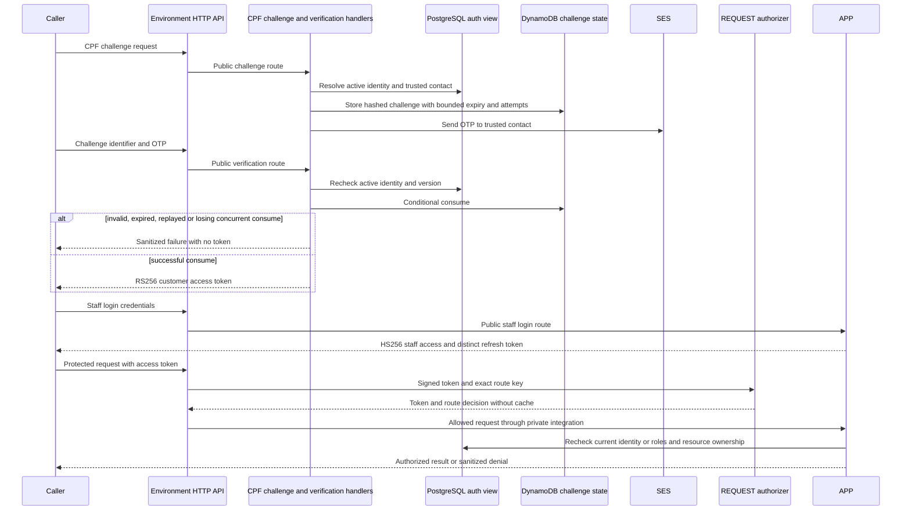

# Customer and staff authentication

The final APP check uses its own repositories, not the function-only auth view; the diagram groups PostgreSQL reads for clarity. Customer RS256 public keys and staff HS256 secrets remain separate. Each path enforces issuer, audience, expiry, purpose, principal type and kid. A discriminator selects a verifier only. Refresh tokens cannot authorize business routes; unknown algorithms, key URLs and cross-environment claims fail closed.

DynamoDB TTL cleanup does not extend OTP validity. A consumed challenge is never reopened after a later signing/response failure. See [ADR 003](../../adrs/003-token-trust.md), [RFC 003](../../rfcs/003-cpf-authentication.md), [FUN rotation contract](../../../../oficina-functions/docs/token-trust.md), [APP trust tests](../../../src/test/java/com/oficina/security/TokenTrustTest.java) and [API exports](../api/contracts.md). Live gateway statuses, initialized secrets and key rotation require separate evidence.
