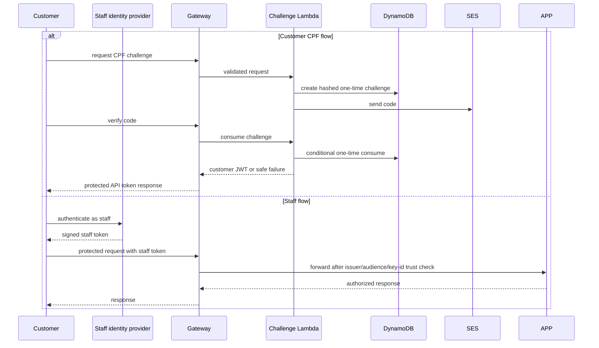

# CPF authentication

Expired, replayed, or invalid codes fail without token issuance. Customer OTP values and credentials never appear in source exports. Staff requests use a configured issuer/audience/key-id trust path and do not consume customer OTP state. The public shapes are in the [API snapshot](../api/contracts.md); Terraform owns the deployed gateway and Lambda binding.
