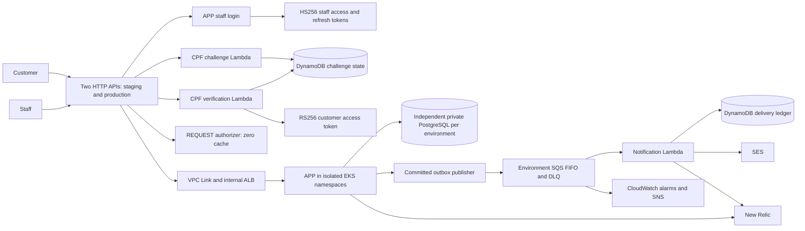

# Components

APP preserves identity/access, workshop orders, catalog, and reporting/delivery contexts. Staff credentials are verified by APP login, not an external identity-provider service. The gateway authorizer performs token/route checks; APP independently validates signed claims, current customer/staff state, ownership and business permissions. Only explicitly allowed versioned routes are exposed.

APP owns Flyway schema, canonical history and transactional outbox. DB owns managed PostgreSQL and credential/network metadata. FUN contains I5 source for Lambda, SQS, DynamoDB, auth routes and authorizer; K8S still contains overlapping earlier definitions. The [single-owner handoff](../../../../oficina-functions/docs/runtime-permissions.md) must complete before FUN roots activate. K8S retains foundation, EKS, API/stage, private routing, workload policy and monitoring; APP cloud orchestration remains a documented gap. Arrows describe source contracts, not measured cloud connectivity.

Evidence: [publisher](../../../src/main/java/com/oficina/adapter/out/outbox/OutboxPublisher.java), [token tests](../../../src/test/java/com/oficina/security/TokenTrustTest.java), [route matrix](../../../contracts/phase3-v2/routes.json), [API exports](../api/contracts.md) and [requirement matrix](../evidence/requirements.md).
