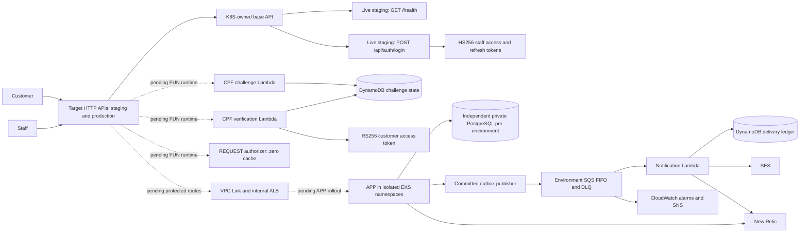

# Components

## Staging boundary observed

The merged [FUN gateway handoff](https://github.com/rafaelxvr/Tech-challenge-15SOAT-functions/pull/6) and [K8S gateway ownership change](https://github.com/rafaelxvr/Tech-challenge-15SOAT-k8s-infra/pull/5) establish the ownership boundary. The live staging API is K8S-owned (`qcm8l43flb`, `$default`) and currently exposes only the public `GET /health` and `POST /api/auth/login` routes. The diagram's dashed FUN, protected-route and APP rollout edges are target integrations; they are not staging acceptance evidence.

APP preserves identity/access, workshop orders, catalog, and reporting/delivery contexts. Staff credentials are verified by APP login, not an external identity-provider service. The gateway authorizer performs token/route checks; APP independently validates signed claims, current customer/staff state, ownership and business permissions. Only explicitly allowed versioned routes are exposed.

APP owns Flyway schema, canonical history and transactional outbox. DB owns managed PostgreSQL and credential/network metadata. FUN contains I5 source for Lambda, SQS, DynamoDB, auth routes and authorizer; the merged handoff assigns the API base and stage to K8S and the runtime/auth integrations to FUN. FUN activation still requires the reviewed runtime inputs, the three missing staging secret slots, immutable artifact verification, and a FUN output receipt returning the four-field `gateway_handoff` to K8S. K8S retains foundation, EKS, API/stage, private routing, workload policy and monitoring; APP cloud orchestration remains a documented gap. Arrows describe source contracts, not measured cloud connectivity.

Evidence: [publisher](../../../src/main/java/com/oficina/adapter/out/outbox/OutboxPublisher.java), [token tests](../../../src/test/java/com/oficina/security/TokenTrustTest.java), [route matrix](../../../contracts/phase3-v2/routes.json), [API exports](../api/contracts.md) and [requirement matrix](../evidence/requirements.md).
