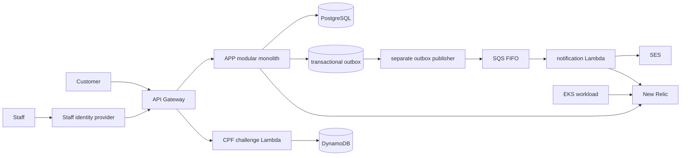

# Components

The gateway is the only public route: it invokes CPF challenge/verification for customer tokens and sends staff requests carrying staff trust material through the same gateway into APP. APP keeps DDD boundaries for identity/access, workshop orders, catalog, and reporting/delivery. APP owns domain rules, Flyway, and the post-commit outbox publisher; FUN owns challenge/token and notification handlers; K8S owns gateway, EKS and Lambda resources; DB owns RDS boundaries.

Implementation evidence: [outbox publisher](../../../src/main/java/com/oficina/adapter/out/outbox/OutboxPublisher.java), [outbox adapter](../../../src/main/java/com/oficina/adapter/out/outbox/OutboxNotificacaoAdapter.java), and [API contract](../api/contracts.md).
