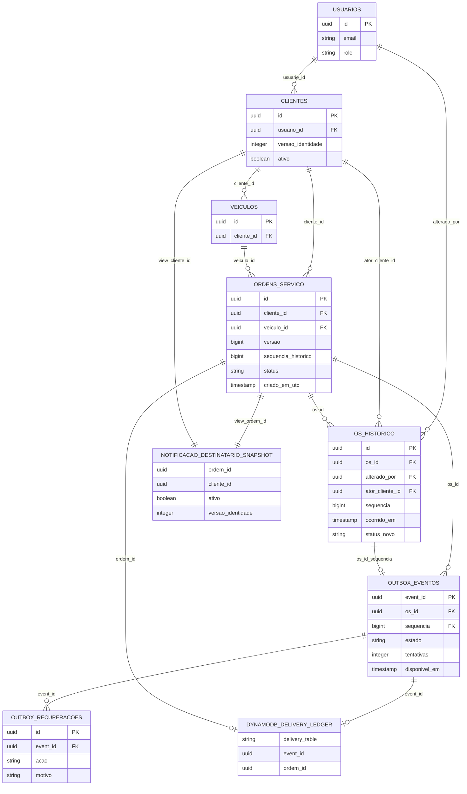

# Data model

`ordens_servico.versao` and `sequencia_historico` are the aggregate counters. `os_historico` stores the canonical timestamp/sequence only for verified new history; V6 allows legacy rows with both absent and constrains actor evidence. V7 adds `outbox_eventos`, with its composite foreign key to `(os_id, sequencia)` in `os_historico`, and `outbox_recuperacoes`, whose `event_id` is a real foreign key to the outbox. `notificacao_destinatario_snapshot` is a PostgreSQL **view**, not a delivery table: it joins the current order/customer contact state for the function's read-only lookup.

The function-owned `DELIVERY_TABLE` DynamoDB ledger is represented separately because it is not an APP PostgreSQL migration table. It claims/completes delivery by event/order and can suppress stale/retried FIFO messages. `outbox_eventos` uses the pending availability index; V8 adds canonical delivery and creation report indexes. Check constraints protect event type/schema/payload, state, attempt and recovery-code invariants; foreign keys retain customer, staff, history and outbox evidence.

[V6 migration](../../../src/main/resources/db/migration/V6__versionar_agregados_e_historico.sql) adds aggregate/history versioning, [V7](../../../src/main/resources/db/migration/V7__criar_outbox_e_destinatario.sql) adds outbox and delivery data, and [V8](../../../src/main/resources/db/migration/V8__indexar_relatorios.sql) provides report/outbox indexes. Operators use the [canonical reporting runbook](../../runbooks/canonical-reports.md) when totals disagree.
