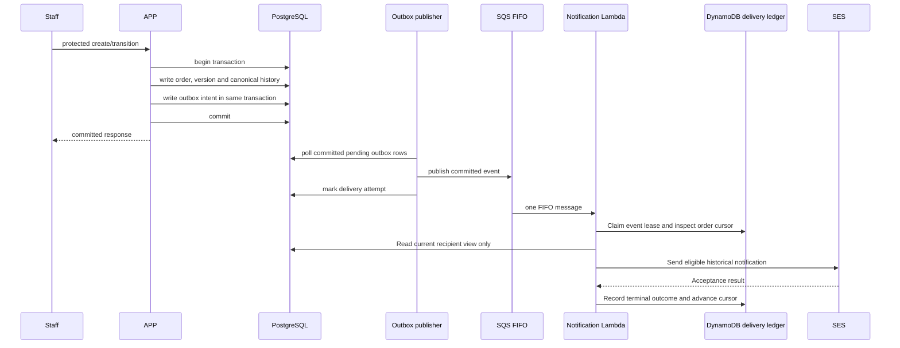

# Order opening and delivery

The separate publisher only observes committed rows; it does not run inside the request transaction. The outbox is durable intent, not exactly-once delivery. Recovery is inspected and operator-directed through the [outbox adapter](../../../src/main/java/com/oficina/adapter/out/outbox/OutboxNotificacaoAdapter.java) and the [canonical reporting runbook](../../runbooks/canonical-reports.md).

If SQS accepts a message but PostgreSQL publication tracking fails, publication can repeat. If SES accepts a send but DynamoDB completion fails, a retry can repeat the email after lease expiry. Neither retry repeats a business transition. The PostgreSQL recipient view is read-only; the delivery ledger is exclusively DynamoDB. See [RFC 004](../../rfcs/004-notifications.md), [ADR 004](../../adrs/004-outbox-delivery.md) and the [FUN residual-duplicate contract](../../../../oficina-functions/docs/notification-delivery.md).
