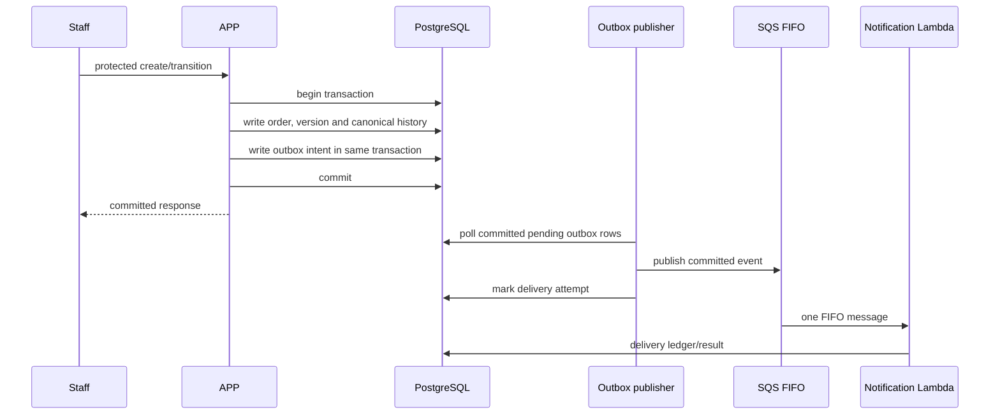

# Order opening and delivery

The separate publisher only observes committed rows; it does not run inside the request transaction. The outbox is durable intent, not exactly-once delivery. Recovery is inspected and operator-directed through the [outbox adapter](../../../src/main/java/com/oficina/adapter/out/outbox/OutboxNotificacaoAdapter.java) and the [canonical reporting runbook](../../runbooks/canonical-reports.md).
