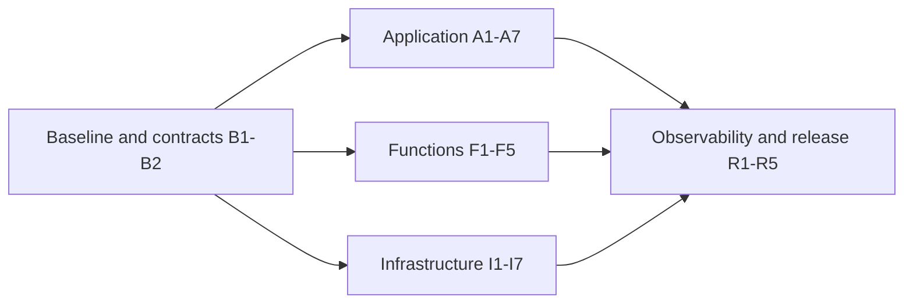

# Phase 3 Implementation Plan

> **For agentic workers:** REQUIRED SUB-SKILL: Use superpowers:subagent-driven-development (recommended) or superpowers:executing-plans to implement this plan task-by-task. Steps use checkbox (`- [ ]`) syntax for tracking.

**Goal:** Deliver the approved Phase 3 application, four repositories, AWS deployment and submission evidence within the free-account constraint.

**Architecture:** Preserve the Java modular monolith and four DDD contexts. Introduce customer/serverless authentication, transactional notifications and reporting through focused application ports/adapters; Terraform and repository-specific pipelines own cloud resources.

**Tech Stack:** Java 17, Spring Boot 3.2.5, Maven, PostgreSQL 16, Flyway, JUnit/Mockito/AssertJ/Testcontainers, Docker/Kind, Terraform, AWS and New Relic Free.

**Spec:** [Approved parent design](../specs/2026-09-14-phase-3-design.md), including its five companion documents. Final design approval: 2026-09-15, user: “approved, proceed”.

## Global Constraints

| Area | Binding values copied from the approved design |
|---|---|
| Engineering | Java 17; Spring Boot 3.2.5; four documented bounded contexts; incremental modular monolith; DDD, OOP, SOLID, KISS, DRY, TDD and Clean Code; `mvn -B verify`; 80% line coverage protection |
| Auth | CPF + email code; 6 digits; 5-minute validity; maximum 5 verification attempts; 60-second resend cooldown; customer JWT 15 minutes, RS256, no refresh; staff HS256 and distinct trust; `identity_version` |
| Infrastructure | `us-east-1`; EKS 1.35; two `m7i-flex.large` workers; two private PostgreSQL 16.15 `db.t4g.micro` instances, 20 GiB gp3 each; HPA staging 1–2, production 2–4; Lambda shared quota 10 |
| Cost | US$0 out of pocket; FREE plan only; no paid upgrade; initial window at most 48 elapsed hours; US$35 window allowance; US$80 project allowance; US$20 separate reserve; US$3 telemetry allocation |
| Delivery | Four repositories; protected main/master; mandatory PRs; develop → staging and main → production; immutable artifacts; no root deployment; no automatic destructive cleanup |

## Working directories and document map

`APP` means the existing checkout `D:/repository/Tech-challenge-15SOAT`. Keep its Git history. `FUN`, `K8S` and `DB` mean new local repositories `D:/repository/oficina-functions`, `D:/repository/oficina-k8s-infra` and `D:/repository/oficina-db-infra`; if a destination already exists, inspect and reuse only if it is the intended repository. Never overwrite or recursively move the current checkout. Repository names are delivery names, not authority to guess a GitHub owner or change visibility.

All task paths are relative to their named repository. Existing paths are marked Modify; Create paths are proposed files. Keep this plan set in APP. Cross-repository implementers must read the referenced specification and the producer task for every consumed interface.

| Plan | Tasks and deliverable |
|---|---|
| This index | B1–B2: reproducible baseline, local repository boundaries and shared wire contracts |
| [Application and data](2026-09-15-phase-3-application.md) | A1–A7: identity/concurrency/history, authorization, outbox and SQL reports |
| [Functions](2026-09-15-phase-3-functions.md) | F1–F5: OTP store/use cases, JWT/authorizer, handlers, notification delivery |
| [Infrastructure and CI/CD](2026-09-15-phase-3-infrastructure.md) | I1–I7: state/IAM, network/EKS, RDS, platform bindings, serverless resources, deployments and pipelines |
| [Observability and release](2026-09-15-phase-3-release.md) | R1–R5: telemetry/probes, dashboards/alerts, docs, AWS rehearsal and submission preparation |



Recommended serial execution: B1, B2, A1–A7, F1–F5, I1–I7, R1–R5. Infrastructure authoring can happen earlier, but cloud creation follows I7/R4's bootstrap phases. F5 consumes A5/A7's wire/view contract. A6 uses the F5 queue contract without requiring deployed AWS. R4 is the first complete paid-resource rehearsal; prior tasks author/test source locally unless an explicit bootstrap prerequisite is being satisfied.

## What was actually checked while planning

On 2026-09-15, this process found Java 25.0.3, Terraform 1.15.8, Kind 0.33.0 and a responding Docker Engine 29.7.2. Maven and Helm were not on PATH. AWS CLI 2.36.44 runs at `C:/Program Files/Amazon/AWSCLIV2/aws.exe` but was not on this process's PATH. These are workstation observations, not installation failures or a test-suite pass. Use Java 17 for project builds; do not change global Java 25 merely to satisfy this project.

No new runtime dependency, implementation source, AWS resource or remote repository was created while writing the plan. Existing user-owned untracked files remain outside the design commits. Audit and explicitly select the existing DDD/Postman material when promoting it into the delivery repository; never use `git add .` here.

## Shared execution conventions

Each Java task follows one failing scenario at a time; a listed scenario matrix is a sequence of small red/green cycles, not permission to write all production classes before testing. Code blocks identify the executable assertion/algorithm; use the existing package imports and JUnit/Mockito style. Every named new test fixture or interface is introduced in a producer task. Keep constructors explicit and use fakes for unit tests, real PostgreSQL for transaction/permission tests.

`./mvnw -B -Dtest=NameTest test` is the POSIX focused-test command; PowerShell uses `./mvnw.cmd -B '-Dtest=NameTest' test`. `./mvnw -B verify` is the full gate. Database tests are named `*Test` so Surefire executes them; Docker unavailability is a failure in the integration job, not an automatic skip. In CI run Java 17 and the complete `verify` goal, including JaCoCo. Run only the meaningful checks for the current task, then the integrated suite at package boundaries.

For infrastructure, provider-mocked `terraform test` tests configuration semantics; they do not prove cloud permissions or service eligibility. A missing managed provider attribute is a dependency-compatibility failure to fix before apply. Commit provider lockfiles and exact image/chart/layer/source pins when resolved; no runtime `latest` selection. Use the installed Terraform 1.15.8 as the initial CLI pin, already above the S3-locking requirement; do not upgrade it as an unrelated task.

### B1: Establish a Java 17 baseline and tool lock

**Files:** APP Create `mvnw`, `mvnw.cmd`, `.mvn/wrapper/maven-wrapper.properties`, `scripts/check-toolchain.ps1`, `toolchain.lock.json`, `docs/phase-3/evidence/baseline.md`; Modify `.github/workflows/ci-cd.yml`, `README.md`.

**Interfaces:** Produces the Maven wrapper commands above and a lock document with `terraform`, `kind`, `mavenImageDigest`, `javaMajor`, and dependency-resolution evidence. No application interface changes.

- [ ] **1 — Record the baseline.** Inspect the current build and tests with the Java 17 Maven container; first resolve its image and save the immutable digest. The tag below is a resolution input, not the final CI/runtime pin.

```powershell
docker pull maven:3.9-eclipse-temurin-17
docker image inspect maven:3.9-eclipse-temurin-17 --format '{{index .RepoDigests 0}}'
docker run --rm --mount "type=bind,source=$PWD,target=/workspace" -w /workspace maven:3.9-eclipse-temurin-17 mvn -B verify
```

The existing unit gate can run in this container; new Testcontainers integration tests will run from a host/CI Java 17 process connected to Docker, not an unconfigured nested Docker container. Record any baseline failure by test/cause; fix only a demonstrated build blocker before continuing.

- [ ] **2 — Make host/CI builds reproducible.** Select an installed Java 17 JDK for this shell, or install a Java 17 JDK when executing this task if absent. Generate the Maven wrapper using the resolved Maven distribution and set `JAVA_HOME`/PATH for this project session only. Store the chosen Maven version and distribution checksum in wrapper configuration. Add a tool check with an actual failure condition:

```powershell
$javaVersion = (& java -version 2>&1 | Out-String)
if ($javaVersion -notmatch 'version "17\.') { throw 'Project build requires Java 17' }
if (-not (Test-Path -LiteralPath './mvnw.cmd')) { throw 'Maven wrapper missing' }
& './mvnw.cmd' -version
if ($LASTEXITCODE -ne 0) { throw 'Maven wrapper failed' }
```

Use the known AWS executable path if PATH is stale; do not reinstall working AWS CLI. Install/resolve Helm only when the infrastructure rendering task needs it, and record its exact version then.

- [ ] **3 — Resolve dependencies before adding them.** Record the chosen release/checksum from each publisher: AWS SDK v2 BOM/Lambda core/events for FUN and the APP SQS adapter; compatible JSON encoder and New Relic agent; AWS/Kubernetes/Helm/New Relic provider constraints and lockfiles. Preserve existing Boot/JJWT/Flyway versions unless a demonstrated compatibility/security finding requires a scoped upgrade. Use Maven repository metadata to identify a candidate, then test and pin it rather than resolving versions during every build:

```powershell
$metadata = Invoke-RestMethod -Uri 'https://repo.maven.apache.org/maven2/software/amazon/awssdk/bom/maven-metadata.xml'
$awsBom = [string]$metadata.metadata.versioning.release
if ($awsBom -notmatch '^2\.\d+\.\d+$') { throw 'Expected an AWS SDK v2 release' }
Write-Output ('AWS SDK candidate for compatibility verification: ' + $awsBom)
```

JSON encoder compatibility is an explicit check: release 9 migrates to Jackson3; the existing application uses Jackson2, so do not select encoder9 solely because Java17 is supported. Verify a compatible release against the existing Logback/Jackson dependency tree and R1's real encoding test; any required scoped dependency adjustment is recorded. [Encoder release compatibility](https://github.com/logfellow/logstash-logback-encoder/releases) Write the actual resolved values to `toolchain.lock.json`; fixture/provider tasks consume those values, never a textual placeholder.
- [ ] **4 — Verify.** Run `./mvnw.cmd -B verify` under Java 17 and the existing Kind job. Expected: current tests/coverage pass, or the evidence records a specific unresolved baseline failure and subsequent work that depends on it waits. A new integration-test job must successfully run `docker info` before Maven.
- [ ] **5 — Commit exact files.** `git add -- mvnw mvnw.cmd .mvn/wrapper scripts/check-toolchain.ps1 toolchain.lock.json docs/phase-3/evidence/baseline.md .github/workflows/ci-cd.yml README.md`; `git commit -m "build: make phase 3 verification reproducible"`.

### B2: Establish repository boundaries and executable wire fixtures

**Files:** APP Create `contracts/phase3-v1/status-event.json`, `contracts/phase3-v1/token-claims.json`, `contracts/phase3-v1/routes.json`, `contracts/phase3-v1/lookup-views.md`, `contracts/phase3-v1/README.md`, `src/test/java/com/oficina/contracts/Phase3ContractTest.java`; FUN Create `pom.xml`, Maven wrapper files, `contracts/phase3-v1/`, `src/test/java/com/oficina/functions/contracts/Phase3ContractTest.java`; K8S/DB Create `.gitignore`, `README.md` and initial `infra/` directories.

**Interfaces:** Produces immutable contract version `phase3-v1`. APP is canonical for HTTP/event/DB-view fixtures; FUN vendors the exact version with a SHA-256 manifest. No shared runtime JAR. Wire event fields are exactly:

```json
{"eventId":"00000000-0000-0000-0000-000000000101","eventType":"StatusOrdemServicoRegistrado","schemaVersion":1,"ordemId":"00000000-0000-0000-0000-000000000201","numero":1001,"clienteId":"00000000-0000-0000-0000-000000000301","versaoIdentidadeCliente":1,"sequencia":1,"statusAnterior":null,"statusNovo":"RECEBIDA","ocorridoEm":"2026-09-15T12:00:00Z","correlationId":"00000000-0000-0000-0000-000000000401","traceparent":null}
```

- [ ] **1 — Red contract test.** In both repositories, load this fixture with Jackson from the repository `contracts/phase3-v1` path and assert the approved fields, types and excluded contact/security data. Initial run: fixture/type absent.

```java
@Test void eventContainsReferencesWithoutContactData() throws Exception {
    JsonNode event = new ObjectMapper().readTree(
        Path.of("contracts/phase3-v1/status-event.json").toFile());
    assertThat(event.get("schemaVersion").asInt()).isEqualTo(1);
    assertThat(event.get("statusNovo").asText()).isEqualTo("RECEBIDA");
    assertThat(event.has("email") || event.has("cpf") || event.has("jwt")).isFalse();
    assertThat(Files.size(Path.of("contracts/phase3-v1/status-event.json"))).isLessThanOrEqualTo(8192L);
}
```

- [ ] **2 — Define remaining fixtures.** `token-claims.json` contains issuer/audience fixtures `oficina-staging-customer`/`oficina-staging-api`, `principal_type=customer`, `token_use=access`, UUID `sub`, positive `identity_version`, and scopes `orders:read:self`, `orders:decide:self`; production uses `oficina-production-*`. Staff issuer is `oficina-{environment}-staff`, same environment API audience, `principal_type=staff`, access/refresh purpose, current email subject. `routes.json` enumerates every actual controller method with allowed actor/role/scope; include the three public auth routes and `/health`, customer canonical/alias routes and denied retired email mutation. No generic authenticated business catch-all. These strings are implementation constants for the already-approved semantics; both validators consume them.
- [ ] **3 — Prepare local repositories.** Create each new directory only after checking it is absent/appropriate, initialize Git locally and add Java 17/JUnit/Jackson/AssertJ plus the resolved BOM to FUN. Keep its packaged Lambda artifact a shaded JAR with handler adapters and no Spring Boot/JPA dependency. Copy only versioned contracts/wrapper files. Leave remote owner/visibility as required release inputs, not guessed URLs. Do not move APP source or user-owned untracked files.
- [ ] **4 — Green.** Run `./mvnw.cmd -B '-Dtest=Phase3ContractTest' test` in APP and FUN. Compare fixture hashes; drift fails CI. Add no-op-free CI `verify` in FUN and `terraform fmt -check -recursive`/validation workflows when K8S/DB gain Terraform roots in I1/I3.
- [ ] **5 — Commit.** Stage the named contract/test/build files in their owning repositories and commit `test: define phase 3 cross-repository contracts`. No push or visibility change occurs in this task.

## Completion and execution choice

| Spec coverage | Implementation tasks |
|---|---|
| DDD/OOP/SOLID, existing behavior and reproducible TDD | B1–B2, A1–A7, F1–F5; focused interfaces and package-level verification |
| CPF/auth/gateway, current identity and owned actions | A1–A4, F1–F4, I4–I6, R4 |
| Four repositories, managed DB/Kubernetes/Terraform, protected automatic delivery | B2, I1–I7, R3–R4 |
| Data correctness, durable serverless notifications and observability | A1–A2, A5–A7, F2/F5, I3/I5, R1–R4 |
| Architectural docs, video, single PDF and reviewer access | R3–R5, with actual deployment/evidence inputs from I7/R4 |

The complete plan contains 26 tasks across five documents: B1–B2, A1–A7, F1–F5, I1–I7 and R1–R5. Checkboxes begin unchecked because no implementation task has run. Task-specific commit scopes never include unrelated files. Final evidence uses the requirement matrix from step 5, not the number of completed checkboxes.

Planning verification on 2026-09-15: specification coverage and cross-task interfaces reviewed; all local Markdown links resolve; all five plan headers and code fences are complete; 26 tasks contain 130 unchecked steps; the placeholder scan and Git whitespace check pass. This verifies the plan documents only. Application tests and cloud acceptance checks have not run during planning.

Choose execution using Superpowers subagent-driven-development or inline executing-plans. After that choice, begin B1; no new design-approval round is required for the decisions already recorded. Deployments, destructive cleanup and external publishing follow the concrete prerequisites in I7/R4/R5.
