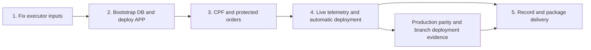

# Phase 3 fastest recordable demo implementation plan

> **For agentic workers:** Use superpowers:subagent-driven-development to implement this plan task-by-task with independent review. This document is a deadline recovery proposal, not permission to resume execution. Implementation is paused at the user's request.

**Goal:** Reach a working AWS demonstration of the assignment as quickly as possible, then complete production evidence and the submission package without redesigning the application.

**Architecture:** Reuse the four repositories, existing AWS EKS/RDS/API Gateway/Lambda infrastructure, Java application and New Relic integration. Connect the missing database bootstrap, first deployment, protected routes and telemetry through the existing private CodeBuild execution path. Terraform owns AWS infrastructure; the existing Kubernetes renderers and deployment scripts manage workload rollout.

**Tech stack:** Java 17, Spring Boot, PostgreSQL/RDS, EKS, API Gateway, Lambda, Terraform, GitHub Actions, CodeBuild, New Relic.

**Spec:** The Phase 3 assignment text supplied by the user; `../specs/2026-09-14-phase-3-design.md` and its linked specifications. This plan proposes changing the order and scope of pre-recording work, not silently deleting accepted requirements.

## Recommendation and deadline estimate

Get one complete staging path working first: **CPF authentication → JWT → protected order creation → PostgreSQL → live New Relic dashboard/log/trace**. Then demonstrate a real automatic deployment and record the working path. Do not wait for every additional operational exercise before recording useful footage.

Planning allowance: **10–18 engineering hours to a recordable staging environment**, followed by **3–6 hours for production parity/evidence** and **1–2 hours for recording, upload and final packaging**. Total: **14–26 hours**, assuming current access works and there are no RDS bootstrap or infrastructure ownership surprises. These are estimates, not a delivery guarantee; they exclude long external approval delays. Work packages below include verification and review.

**Deadline confirmed by the user: 15 September 2026. Today is 18 September 2026; the deadline was three calendar days ago. The user reports a grade reduction each additional day. The exact penalty rate and daily cutoff are unknown.** Optimize for the earliest complete submission, not another round of platform improvements. The estimates above are planning allowances, not a reason to wait before capturing completed demonstration chapters.

### Overdue delivery priorities

1. **First 60 minutes after execution resumes:** resolve the executor image/source mismatch and attempt the private bootstrap/APP startup path. This is a diagnostic timebox, not a promise that rollout will finish within an hour. Report either a healthy application or the exact failing command, cause and next fix. Do not spend this block adding another metadata-only contract.
2. **Next runtime work block:** complete bootstrap, first rollout, CPF authentication and protected order routes. Bundle closely related changes into a working feature and review that feature once, with targeted regression tests. Reuse the working FUN executor when its review supports it; rebuild only if a concrete compatibility or security issue requires it.
3. **As soon as the user journey works:** populate New Relic and capture the authentication/orders/monitoring chapters. Prepare current diagrams, repository links and the PDF manifest alongside runtime work using the approved bounded subagent workflow. Record real deployment execution while doing the necessary rehearsal rather than scheduling a second rehearsal solely for filming.
4. **Before the final compliance claim:** obtain the required authorization and close production branch deployment evidence, repository access and publication. These are assignment requirements and remain on the critical path; staging footage alone does not satisfy them. If one cannot be completed promptly, state the precise gap and let the user decide whether to submit a disclosed partial delivery rather than incur another day's penalty.
5. **Stop at the assignment deliverables for submission:** after the required runtime demonstrations, documentation, access, video and PDF checks pass, deliver immediately. Schedule optional extended acceptance/hardening separately; do not mark the original broader goal complete merely because the assignment package is submitted.

No new provider, architecture rewrite, general image provenance framework, exhaustive fault campaign, or stand-alone guard-documentation PR belongs on the pre-submission path. Keep authentication, secret protection, migration correctness, meaningful tests and review. Implementation remains paused until the user resumes it; supplying the deadline does not itself authorize a deployment or publication.

## Global constraints

- Keep DDD, OOP, SOLID, KISS, DRY and existing test/coverage protection; modify deployment adapters instead of refactoring working business logic.
- Preserve CPF checks, customer status lookup, token validation, authorization, private DB connectivity, protected branches and secret handling. Use synthetic customer data and a working staff identity.
- Reuse the existing AWS account/region and New Relic account **8521907**, supplied by the user. Validate access with existing credentials without printing them. Do not switch providers or recreate the cluster/database.
- Existing authorization covers staging work; implementation is currently paused. Production activation, reviewer invitations and video/portal publication require the applicable explicit authorization before execution. Prepare those actions first.
- Record only real runtime results. Staging readiness, full assignment compliance, and the original broader acceptance plan are distinct milestones.

## Evidence inspected on 2026-09-18

Repository aliases in this plan:

| Alias | GitHub repository | Inspected local source |
|---|---|---|
| APP | `rafaelxvr/Tech-challenge-15SOAT` | `.worktrees/app-staging-activation-contract`, plus merged PR #26 |
| K8S | `rafaelxvr/Tech-challenge-15SOAT-k8s-infra` | `D:/repository/oficina-k8s-infra` |
| FUN | `rafaelxvr/Tech-challenge-15SOAT-functions` | `D:/repository/oficina-functions` |
| DB | `rafaelxvr/Tech-challenge-15SOAT-db-infra` | Existing deployment receipts; revalidate live DB readiness in package 2 |

The root APP checkout contains older design files and user-owned untracked documents. Implement from current remote `develop` in an isolated checkout, not by assuming the root checkout is current.

| Evidence | What it proves / does not prove |
|---|---|
| APP PR #26 merged as `4755df539405fda6ce92b908a3658da37d80c71e`; CI run `35354066886` succeeded | Source checks and integration tests passed. APP cloud deployment remains disabled. |
| Live APP CodeBuild still references missing deployer digest `d2e871...` and `releases/application/staging/bundle.zip` | Its image and source prefix must be corrected. Required prefix is `releases/app/staging`. |
| Live FUN CodeBuild uses existing runtime digest `e40c301b50bafa5cb78acf8da7e1f5a5d8615c4b0228c375dc536256a4949daf` | There is already an executor candidate in actual use; a new image supply-chain project is not automatically necessary for the assignment. |
| Live Lambda inventory contains staging challenge, verification, authorizer and notification functions | Functions exist. It does not prove successful database access, OTP delivery or JWT issuance. |
| Live gateway `qcm8l43flb` has `/health`, staff login and two CPF routes, but no order routes | Protected business-route wiring is an explicit remaining task. Public login/CPF routes using `NONE` are expected; business routes need the authorizer. |
| Live staging target group returns `[]` | No application targets are registered. This is the immediate runtime gap. |
| APP `scripts/deploy.ps1` always throws `APP_DEPLOYMENT_DISABLED` on apply | Metadata generation alone cannot deploy the application. |
| APP `scripts/deploy-app.ps1` reads an existing Deployment/HPA/service account before rollout | Initial provisioning must create the platform workload safely. An empty cluster cannot be handled by simply turning on this script. |
| APP `BootstrapMain` already prepares roles, runs Flyway and proves grants | Reuse it; its private executor packaging and release integration are missing. Do not build a second database bootstrap implementation. |
| K8S/FUN successful staging receipts and prior DB receipt | Useful infrastructure evidence. Inspect apply mode/resource results; receipts alone do not prove the user journey works. |

## Local preparation checkpoint — 2026-09-18

This update records merged local evidence only. The dated AWS observations below were not rechecked; the runtime, authorization and recording blockers remain open. None of the five runtime work packages or the ready-to-record gate is complete.

- [x] Merge the credential-free local acceptance harness: [APP PR #36](https://github.com/rafaelxvr/Tech-challenge-15SOAT/pull/36), merge `85a7227c94cf322cd1bdab3f2f0cb43099370a81`. The [local checkpoint](../../phase-3/evidence/local-acceptance-2026-09-18.md) records ten suites, zero failures and `PASS_LOCAL_WITH_SKIPS`; New Relic dynamic Helm checks were skipped because Helm was unavailable. The receipt belongs to tested APP head `9a4ba4846334c72e459bb9a52ebf5f3176894b91`, not a rerun of the merge.
- [x] Reconcile the central audit and submission references: [APP PR #39](https://github.com/rafaelxvr/Tech-challenge-15SOAT/pull/39), merge `4bca0556bee584b7c2a9304d0dd5c5f82a7edefc`. Receipt `D:\repository\phase3-local-acceptance-20260918-6.json` has SHA-256 `d8a90265a369860b56ed470cae7d83d8cf4e506623f81c55afdb39ce7a85a029`. The [audit](../../phase-3/evidence/implementation-audit.md) retains all eight R4 records as `NOT_RUN`; the [submission manifest](../../phase-3/submission/submission-manifest.json) remains `NOT_READY`. Expired AWS SSO, APP publication/promotion and runtime gaps remain unresolved.
- [x] Verify the offline APP/FUN guard tests on the reviewed source present in `develop`: APP [49 rejection/disabled-path contracts](https://github.com/rafaelxvr/Tech-challenge-15SOAT/blob/85a7227c94cf322cd1bdab3f2f0cb43099370a81/tests/production-promotion-contract.ps1) and FUN [44 rejection/disabled-path contracts](https://github.com/rafaelxvr/Tech-challenge-15SOAT-functions/blob/dbceabcf3dd9d11597af98825c3ca54159cbbf4f/tests/production-promotion-contract.ps1) passed. These only validate main-branch gates, same-commit staging receipt/source hashes and valid-but-disabled behavior; no production identity, build or deployment was attempted. Promotion of the reviewed changes to `main`, production authorization and actual production execution remain pending.

All original checklist entries below remain unchecked: local contracts and template checks do not prove cloud deployment, runtime behavior, recording, reviewer access or final submission.

## What changes to save time

| Do now | Defer or avoid |
|---|---|
| Deliver one working vertical slice with focused tests and review | More stand-alone documentation/metadata guard PRs that do not enable runtime |
| Review whether the executor already used by FUN is suitable for APP | A new general-purpose builder/signing/SBOM framework as a prerequisite to a student demo |
| Triage existing image findings for actual executor exposure and available fixes | Treating scan counts alone as proof of exploitability or proof the image is safe |
| Retain migration failure checks, workload IAM, TLS, digest pinning, secrets and basic rollback | Exhaustive fault injection, long load tests, extended soak tests and broad DDD refactoring before recording |
| Reuse current renderers, bootstrap code, dashboards, API snapshots and PDF tools | A second application Terraform root solely to satisfy an empty tfvars placeholder |

The deferred operational exercises remain tracked under the original goal. They are not newly marked complete. If an existing guard prevents the chosen implementation, change it explicitly with focused tests/review; do not delete it just to make the workflow green.

## Critical path

Recording the staging chapters can start after package 4. Full-compliance claims and final delivery require the production and submission checks in package 5 as well.

### 1. Make the existing executor usable — 1–2 hours

**Ownership/files:** K8S `infra/modules/deployment-executor/`, `infra/foundation/` and the actual external foundation variable inputs. APP `scripts/start-deploy.ps1` and `.github/workflows/staging-deploy.yml` only if integration requires a change.

**Inputs:** Current CodeBuild configuration, existing ECR digests, approved staging account/region, source prefix and state paths.

**Output:** APP CodeBuild can start, fetch its exact source and run deployment tools against the private environment.

- [ ] Inspect the existing FUN executor image's tool versions and relevant HIGH findings. Prefer reusing its exact Linux/amd64 digest if review supports use for this bounded rehearsal. A fresh image is the fallback if required tools are missing or a relevant finding needs remediation; rebuild only the existing Dockerfile, with a unique tag and recorded digest.
- [ ] Update APP executor image and source prefix together through its owning Terraform inputs. Preserve `application/staging.tfstate`, its lock and the reviewed trusted input path. Review the plan; stop on unrelated destruction or production changes.
- [ ] Generate real nonsecret platform metadata from AWS, including the known New Relic account. Generate missing credentials only after checking for existing versions; do not rotate functioning credentials accidentally.
- [ ] Run the existing source-prefix/executor contracts, then a private executor preflight proving tool startup, EKS API access and RDS network reachability. Capture one concise result.
- [ ] Review the integrated change and apply the authorized staging correction after execution is resumed. If this package exceeds two hours, report the concrete failing operation and revised estimate instead of opening another generic contract project.

### 2. Connect database bootstrap to the first APP deployment — 4–6 hours

**Ownership/files:** APP `src/main/java/com/oficina/bootstrap/BootstrapMain.java`, `scripts/deploy.ps1`, `scripts/deploy-app.ps1`, `scripts/render-app-release.ps1`, `scripts/app-release-contract.ps1`, `tests/app-rollout-contract.ps1`, `tests/staging-rollout-contract.ps1`; a focused bootstrap image definition if needed. K8S `scripts/render-platform.ps1`, `scripts/render-runtime-public-configmap.ps1`, `k8s/platform/base/` and IAM resources in their current Terraform owner.

**Inputs:** Existing RDS endpoint/master secret, exact runtime secret versions, RDS CA, source commit and usable private executor.

**Output:** Schema V8 and restricted DB roles verified; APP pods ready; at least one healthy ALB target; gateway health succeeds.

- [ ] Inventory existing DB schema and Kubernetes objects, create the missing staging APP/migration identities and access bindings through their owners, and establish secret/CA mounts. Runtime APP/FUN identities must never receive the DB master credential. Create initial workload objects at zero replicas so no writer starts before bootstrap.
- [ ] Package the existing Java bootstrap entrypoint and exact migration resources from a tested APP commit. Invoke it from a short-lived private bootstrap job with the reviewed references. It already runs Flyway: avoid running a second independent migration sequence just to satisfy the previous Flyway-only job shape.
- [ ] Implement the missing orchestration adapter: acquire deployment lock, verify inputs/window, drain any existing writer, run bootstrap/migration/grant proof, validate its receipt, then start the app and wait for health. On a fresh deployment, model initial creation explicitly instead of inventing `previousImage`. On failure, stop before starting a writer; do not automatically reverse migrations.
- [ ] Bind the APP runtime image to an actual tested build, configure the deployment/probes/HPA/service and target-group binding, then verify private database access and a healthy ALB target. Keep infra ownership in Terraform; define meaningful orchestration inputs instead of supplying empty tfvars. Review any required launcher contract change as part of this same runtime feature.
- [ ] Test bootstrap against PostgreSQL and rollout failure behavior, then run the staging workflow end to end. Exit only with rollout evidence and HTTP health success; a rendered manifest or mocked rollout is insufficient. If RDS permissions block bootstrap, fix that exact grant/capability issue before starting authentication work.

### 3. Make the demonstration user journey work — 1–3 hours

**Ownership/files:** FUN `infra/modules/functions/runtime/gateway.tf` and staging inputs; K8S `infra/modules/platform-environment/` route configuration; APP existing security/controllers and `scripts/rehearsal/smoke.ps1`. Preserve the established ownership handoff between FUN authorizer and K8S business routes.

**Inputs:** Running APP, migrated tables/views, existing Lambdas, authorizer output and operational notification credentials.

**Output:** A repeatable script/Postman flow demonstrating CPF, a JWT and authorized order APIs through API Gateway.

- [ ] Seed synthetic customer/vehicle/service data and a separately provisioned staff identity using supported paths. Avoid relying on the disabled development administrator. Confirm the SES sandbox sender/recipient setup required by the existing OTP flow; reuse a verified mailbox.
- [ ] Test CPF challenge and verification against the live Lambdas, with real customer status lookup and JWT issuance. Reuse the implemented flow rather than replacing it with a hard-coded token or weaker CPF-only shortcut.
- [ ] Add the missing protected order routes through their Terraform owner using the deployed authorizer. Verify a valid token reaches the APP, no token is rejected, and an unauthorized customer cannot read another customer's order. Account for legitimate staff/customer permissions in the demo.
- [ ] Execute one order from creation through relevant status transitions and confirm the DB state. Trigger one real notification on the existing path if required by the accepted design. Repair only runtime integration failures exposed by this flow.
- [ ] Save sanitized request/status evidence and a runnable demonstration collection with private credentials injected at execution. Exit when the same flow works twice without manual DB repairs.

### 4. Prove live observability and automatic staging deployment — 2–4 hours

**Ownership/files:** K8S `observability/newrelic-values.yaml`, `scripts/render-newrelic-bundle.ps1` and existing monitoring infrastructure; APP `observability/dashboard-queries.json`, existing observability adapters, logging configuration and `.github/workflows/staging-deploy.yml`.

**Inputs:** Running end-to-end flow and New Relic account `8521907` with working ingest/query access.

**Output:** Populated dashboard, correlated logs/traces, observed alert and automatic deployment evidence from the staging branch.

- [ ] Enable/repair the existing New Relic integration and verify API latency, Kubernetes CPU/memory, health/uptime, JSON logs and trace correlation from real requests. Confirm resource headroom after monitoring agents are installed.
- [ ] Create or repair one dashboard using the existing queries: daily order volume, average time by Diagnóstico/Execução/Finalização, and integration errors. Generate actual transitions with elapsed time so panels contain meaningful observations rather than static samples.
- [ ] Trigger a bounded, recoverable processing failure using synthetic data, show its structured log/trace and alert, then restore normal operation. Never damage business data merely to produce an alert. Allow for the actual alert evaluation/ingest interval.
- [ ] Merge one reviewed change to the staging branch and show the automatic pipeline execute a real deploy, followed by healthy pods and API checks. Capture timestamps, source commit and run URL. A manual dispatch or Terraform plan alone does not demonstrate the required branch-triggered deployment.
- [ ] Complete the ready-to-record gate below and capture the staging demonstration while the environment is healthy. Use one worker for runtime work and one independent reviewer; documentation/telemetry preparation may proceed in a separate bounded task once runtime inputs are stable.

### 5. Close production evidence and the delivery package — 4–8 hours

**Ownership/files:** Existing production environment roots/workflows across the four repositories; APP `docs/phase-3/submission/video-script.md`, `submission-manifest.json`, submission README, architecture/RFC/ADR/ER docs and `scripts/submission/`.

**Inputs:** Working staging release, protected branches, current architecture and verified repository URLs.

**Output:** Evidence of both branch deployments, a video no longer than 15 minutes and one real submission PDF.

- [ ] Prepare a production plan using the same tested artifacts and existing production topology. List resource/cost differences and obtain production authorization before applying. Run a protected production-branch merge and confirm automatic deployment, health and environment isolation. Inspect all four repositories' CI/CD: every required environment path must be functional. Do not assume successful staging proves production.
- [ ] Reconcile READMEs and diagrams with the actual deployed system: component and both sequence diagrams, RFCs, ADRs, ER model/relationships, DB justification, run/deploy steps and API links. Reuse current documents; remove obsolete claims that disabled paths are ready. Finish the original acceptance evidence separately without fabricating PASS values.
- [ ] Record the 14-minute script below. Show real branch-triggered CI/CD, API requests, populated monitoring and correlated logs/traces. Long deployments may be time-compressed with their actual timestamps displayed; keep the live results visible.
- [ ] Verify `soat-architecture` access across all four repositories. Prepare invitations if needed and perform them only with authorization; a pending invitation is not accepted access. Upload the video to the authorized YouTube/Vimeo destination and verify viewer access and duration.
- [ ] Populate the existing submission manifest, render the final PDF with `scripts/submission/build_pdf.py`, validate with `check_submission.py`, and open the PDF to check every repository/video/documentation link. Do not use template/fixture flags to claim submission readiness. The user completes or explicitly authorizes portal submission; cleanup follows only after recording and separate approval.

## Ready-to-record gate: all must be observed

| Check | Observable proof |
|---|---|
| Cloud application and managed database | Ready EKS pods, healthy target, successful health request and persisted synthetic order in RDS |
| CPF and protected APIs | Real Lambda challenge/verification/status lookup, JWT issuance, allowed request and denied unauthenticated request |
| Delivery pipeline | Actual automatic staging deployment from a protected PR merge, linked to the running image |
| Monitoring | Live API latency, Kubernetes CPU/memory, health/uptime, all three business dashboard categories, JSON logs, correlated trace and an observed processing-failure alert |
| Presentation | Working request collection, readable diagrams and prepared tabs; secrets/tokens/passwords hidden |

**Staging recording readiness is not full assignment compliance.** Full compliance additionally requires functioning production branch deployment, all four repositories with CI/CD and complete documentation, the published video, reviewer access confirmation and final submission PDF. If production cannot be completed before the deadline, disclose that explicit gap; do not claim a staging-only delivery meets that literal requirement.

## Assignment coverage

| Assignment requirement | Package / evidence |
|---|---|
| API Gateway; sensitive routes protected; CPF validation, customer existence/status lookup and JWT from serverless function | 3: real positive/negative requests through the gateway |
| Four repositories: Lambda, Kubernetes Terraform, managed DB Terraform and APP on Kubernetes | 5: accessible repositories and meaningful ownership/docs |
| CI/CD in each; protected main/master, mandatory PRs; automatic staging and production branch deployments | 4–5: repository rules and actual deployment run evidence, not only workflow YAML |
| Cloud gateway, serverless, managed DB, scalable Kubernetes and Terraform provisioning | 1–3 and 5: deployed resources, HPA configuration/metrics and applied Terraform evidence |
| API latency, CPU/memory, health/uptime, order-processing alerts, JSON request correlation | 4: live New Relic data and observed alert |
| Daily orders, average duration by required status, integration errors | 4: populated dashboard panels reflecting real test activity |
| Component diagram; authentication and order-opening sequence diagrams | 5: current, readable diagrams |
| RFCs, ADRs, database choice/model justification and ER relationships | 5: existing docs verified against actual deployment |
| Per-repository purpose, technologies, execution/deploy steps, architecture and Swagger/Postman links; Dockerfiles where applicable | 5: README/API/document checks |
| Video up to 15 minutes on YouTube/Vimeo showing auth, CI/CD, automatic deployment, protected APIs, dashboard, logs and traces | 5: measured recording and verified playback link |
| One PDF with four repository links, video/docs links and confirmation of soat-architecture access | 5: rendered final PDF and verified access |

The brief also mentions serverless notifications in its challenge narrative. Preserve and demonstrate the implemented notification path where possible; do not turn an exhaustive notification retry/recovery campaign into a prerequisite for the first recording. The broader approved acceptance tests remain tracked rather than silently removed.

## Fourteen-minute recording order

| Time | Demonstration |
|---|---|
| 00:00–02:00 | Four repositories, cloud component diagram and managed PostgreSQL choice/ER model |
| 02:00–06:00 | Synthetic customer CPF authentication, JWT, protected order flow/status transitions, rejected unauthenticated request |
| 06:00–09:00 | Protected PR merge, real automatic deployment records, running image and healthy Kubernetes pods/HPA |
| 09:00–13:00 | Live latency/resource/business dashboards, correlated JSON log and trace, processing failure alert and recovery |
| 13:00–14:00 | RFC/ADR/sequence documentation, production deployment evidence and delivery links |

## Execution decision

Next action under two minutes: resume implementation under these overdue-delivery priorities. Start package 1 and move directly into the APP bootstrap/first rollout. Keep one implementation/review cycle per working feature and report observable runtime progress, not the count of new guard tests or PRs. Keep the separately required production/publication authorizations explicit.
