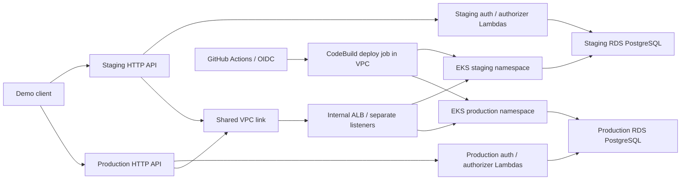

# Phase 3 — step 3B AWS sizing and delivery design

Status: approved by the user ("approved, proceed"), including the two-HTTP-API amendment and US$35 window allowance. Step 3A (temporary shared EKS, local Kind, free-plan credits only) is also approved. This is design approval; implementation follows completion of the remaining design reviews. Parent: [Phase 3 specification](2026-09-14-phase-3-design.md).

## Approved design decision

Use the following study environment in `us-east-1` for the initial window of at most 48 elapsed hours. Estimate approximately **US$32 of credit consumption**, with a **US$35 window allowance**, within the approved US$80 project allowance and US$20 reserve. Personal spending remains **US$0** and the AWS plan remains FREE.

1. One EKS cluster, two `m7i-flex.large` workers, and separate staging/production namespaces.
2. Two small RDS PostgreSQL instances, one per environment, so database infrastructure changes can be deployed independently.
3. Two API Gateway HTTP APIs, one per environment, sharing private network/ingress infrastructure. **This explicitly amends step 2C's single HTTP API instance assumption**; authentication contracts and the Lambda authorizer pattern remain the same.
4. Environment-specific Lambda functions, DynamoDB challenge tables and secrets; SES sandbox delivery to verified demonstration addresses.
5. Four GitHub Actions pipelines, with OIDC and short CodeBuild deployment jobs inside the VPC for private Kubernetes/database access.

The second HTTP API has no additional fixed hourly gateway charge under the HTTP API request pricing model. It allows separate routes, authorizers and releases without introducing shared stage-variable trust configuration. This amendment was included in the user's step 3B approval. [API Gateway pricing](https://aws.amazon.com/api-gateway/pricing/)

## Verified account constraints

Read-only checks on 2026-09-14 returned these values. They establish planning inputs, not guaranteed resource creation or live application performance.

| Check | Result | Consequence |
|---|---|---|
| Free plan | FREE / ACTIVE; US$100 credits; expiration March 14, 2027 | Recheck before every cloud window and deployment; no plan upgrade |
| EC2 standard On-Demand vCPUs | 5; no pending/running regional EC2 instances found | Two 2-vCPU workers fit; a third does not fit the remaining 1 vCPU |
| EKS clusters / versions | Cluster quota 100; 1.35 and 1.36 in standard support | Propose EKS 1.35; its standard support ends March 27, 2027, after the current Free plan |
| Lambda / CodeBuild concurrency | Lambda 10; CodeBuild Linux/Small 15 | Throttle demonstration traffic; serialize deployment jobs by environment |
| RDS / SES | RDS quota 40 instances, none used; PostgreSQL 16.15 with `db.t4g.micro` and gp3 is orderable with 20 GiB minimum. SES sandbox: 200 messages/day, 1/second | Two RDS instances fit the observed quota; email delivery remains restricted to verified recipients |

The observed Lambda quota is much lower than the commonly documented default. Do not configure assumed reserved/provisioned concurrency: AWS documents a minimum unreserved pool of 100 for reservations. Use the actual shared quota, short timeouts, bounded test concurrency and gateway throttles; handle throttling explicitly. [Lambda reservation constraints](https://docs.aws.amazon.com/lambda/latest/api/API_PutFunctionConcurrency.html), [EKS lifecycle](https://docs.aws.amazon.com/eks/latest/userguide/kubernetes-versions.html)

## Compute and capacity

| Component | Initial configuration | Bound / reason |
|---|---|---|
| Cluster | EKS 1.35, managed node groups, AL2023 x86-64; private Kubernetes API endpoint | Pin compatible provider/add-on/AMI versions in the implementation lockfiles; no EKS Auto Mode or Fargate in this estimate |
| Workers | Two `m7i-flex.large`, each 2 vCPU / 8 GiB RAM and encrypted 20 GiB gp3; one single-node group in each of two AZs | Total 4 vCPU / 16 GiB before Kubernetes reservations. Each group min/desired/max = 1 |
| Staging application | HPA min 1 / max 2 | Per pod: request 250m CPU / 768 MiB, limit 1 CPU / 1 GiB; initial CPU target 60% |
| Production application | HPA min 2 / max 4, topology spreading, PDB minAvailable 1 | Same resource settings; readiness/startup/liveness checks, JVM heap capped below container memory |
| Platform / deployment headroom | Budget up to 1.25 CPU / 3 GiB requests for system add-ons and lightweight telemetry; at most two extra application rollout pods | At maximum HPA plus two rollout pods, application requests are 2 CPU / 6 GiB. Combined planning envelope: 3.25 CPU / 9 GiB |

The 3.25 CPU / 9 GiB envelope must be checked against actual allocatable resources and pod/ENI limits. It is a sizing hypothesis, not a load-test result. Run migrations before rollouts, and avoid simultaneous capacity demonstrations and node maintenance. If step 4's observability stack exceeds the envelope, adjust it and reprice before deploying.

HPA demonstrates pod scaling within fixed worker capacity; there is no automatic worker expansion in this study profile. Pin managed-node updates to the **MINIMAL** strategy, update only one group at a time and verify the other node is healthy first. The default surge strategy can request a third 2-vCPU node and exceed the observed account quota. Node replacement temporarily reduces capacity, and full availability during that maintenance is not promised. [EKS node update strategies](https://docs.aws.amazon.com/eks/latest/userguide/managed-node-update-behavior.html)

For evidence, demonstrate HPA using bounded synthetic traffic against authenticated application endpoints; an in-cluster load generator can exercise pod capacity without exhausting the gateway authorizer quota. Separately demonstrate all required customer/staff flows through API Gateway. Record time/request limits and verify recovery after load ends.

## Network and database topology

Use one VPC across two AZs, with public NAT subnets, private workload/deployment subnets and isolated database subnets. One zonal NAT gateway supplies outbound access for workers, VPC-connected functions and CodeBuild. S3 and DynamoDB gateway endpoints avoid sending that traffic through NAT. Do not add interface endpoints, public worker addresses, additional load balancers or NAT gateways without updating the estimate. VPC CodeBuild needs outbound connectivity for public service endpoints. [CodeBuild VPC requirements](https://docs.aws.amazon.com/codebuild/latest/userguide/vpc-support.html)

Use one internal ALB with distinct staging/production listener ports and IP target groups. A shared VPC link reaches those listeners; fixed integrations choose the correct environment. Preserve `/api/...` paths with explicit request mapping. The public edge uses the default AWS HTTPS hostname, so this plan requires no domain purchase. The initial private ALB-to-application path uses HTTP restricted by security groups; this is not end-to-end TLS. [HTTP API private integrations and path mapping](https://docs.aws.amazon.com/apigateway/latest/developerguide/http-api-develop-integrations-private.html)

The platform repository's Terraform owns the ALB, listeners, target groups, security rules, gateway shells, VPC link and fixed backend integrations. Platform-managed `TargetGroupBinding` objects bind the fixed application Service names to these pre-created target groups. The AWS Load Balancer Controller manages target registration only for this path; Terraform does not also manage individual pod attachments. Application deployment roles cannot create or rebind target groups. [Controller ownership model](https://kubernetes-sigs.github.io/aws-load-balancer-controller/latest/guide/targetgroupbinding/targetgroupbinding/)

Create two RDS PostgreSQL **16.15**, `db.t4g.micro`, Single-AZ instances with encrypted **20 GiB gp3 each**. Disable storage autoscaling for the bounded study configuration. Use private endpoints, TLS with certificate validation for JDBC, one-day automated backup retention, no read replicas, no RDS Proxy, and separate database/application/migration/authentication credentials for each environment. Recheck the supported minor version at implementation and test its Flyway compatibility before pinning it.

RDS generates and stores the master credential in Secrets Manager. The reviewed bootstrap job creates restricted migration, application and authentication-view roles; ordinary applications/functions never receive the master secret. Application Hikari pools start with a maximum of 5 connections per pod and minimal idle connections. Lambda customer lookup uses at most one JDBC connection per execution environment with stale-connection recovery. Measure both live and idle connections under warm-container churn against the database's real connection limit.

Two workers improve pod recovery, but each database is Single-AZ, the NAT is shared and the cluster is shared. Staging/production have separate release/data/secret boundaries, not independent failure domains or a production HA guarantee. Namespace RBAC, default-deny network policies, distinct service accounts and environment-specific AWS permissions are required.

## Functions, secrets and telemetry allowance

Use separate deployed function resources per environment for challenge creation/verification and the request authorizer. Start without provisioned concurrency, without an authorizer result cache and without a refresh-token service, as approved. Benchmark cold starts against the gateway timeout. Select function memory by measurement; the estimate below allows 200,000 invocations at an average of 1 GB-second each across all functions.

Each environment has a DynamoDB Standard on-demand challenge table with conditional writes for attempt limits and one-time consumption. Store expiry explicitly and check it in code; TTL is eventual cleanup. Set bounded on-demand throughput settings where supported. CPF/IP rate-limit identifiers use keyed hashes; no raw CPF, OTP or bearer token enters logs. PostgreSQL remains the customer/business source of truth.

Use Secrets Manager with environment-scoped access for runtime database credentials, signing keys, staff HMAC secrets and OTP hashing material. Terraform owns secret metadata and references, not generated private key values or plaintext runtime passwords in `.tfvars`. Platform installs the secrets-mount integration; application pods read their configuration through the existing Spring configuration boundary. AWS SDK, JDBC and email implementations remain infrastructure adapters behind narrow application ports.

SES sending stays in the existing sandbox using verified test identities. Demo rate limits and retries must respect the account's shared 1 message/second limit and 200/day total. No request for broader sending access is implied.

The estimate reserves money and node capacity for logs, metrics, traces and serverless notifications. Approved [step 4B](2026-09-14-phase-3-notifications-design.md) defines notification delivery; approved [step 4C](2026-09-14-phase-3-observability-design.md) selects New Relic Free and native AWS alerts within that allowance. A paid Datadog/New Relic subscription is not included or authorized. Recalculate the estimate if implementation measurements require billable infrastructure beyond the allocation or exceed the capacity envelope.

## Cost worksheet — 48 hours

USD rates were checked on 2026-09-14 for `us-east-1`. EC2, EBS, RDS, NAT, IPv4, ALB, Lambda duration and HTTP API rates came from the read-only AWS Price List `GetProducts` API. CodeBuild uses its published Linux/Small rate. No Savings Plans, Spot discount, extra promotional credit or free monthly usage deduction is assumed. Monthly storage is approximated with 730 hours; billing rounding and actual usage can differ.

| Group | Calculation / assumption | 48-hour estimate, rounded up by group |
|---|---|---:|
| Kubernetes and workers | EKS `48 × $0.10`; two workers `96 × $0.09576`; 40 GiB EBS `40 × $0.08 × 48/730` | $14.21 |
| Managed databases | Two instances `96 × $0.016`; 40 GiB RDS storage `40 × $0.115 × 48/730` | $1.84 |
| Network foundation | NAT `48 × $0.045`; one IPv4 `48 × $0.005`; internal ALB `48 × $0.0225`; allowance of one used LCU for each hour `48 × $0.008` | $3.87 |
| Delivery and serverless traffic | 300 CodeBuild minutes `× $0.005`; 200,000 Lambda GB-seconds `× $0.0000166667` plus `$0.04` request fees; 100,000 HTTP API requests `× $0.000001` | $4.98 |
| Other usage allowance | $1.50 data transfer/NAT processing; $2.50 secrets, challenge storage/requests, email/notifications, S3/ECR/backups; $3.00 telemetry ingestion/storage/queries/alarms | $7.00 |

The grouped estimate is **US$31.90**. Round the cloud window allowance to **US$35**, leaving **US$3.10 contingency** within that allowance. The separately approved **US$20 project reserve remains untouched in this allocation**. These are forecasted credit deductions, not a fixed-price quote or a hard billing cap. After a US$35 window, only US$45 of the original US$80 project allowance remains, before any intervening usage.

The US$7 variable allowance assumes low-volume test data: up to 10 GB through NAT, up to 5 GB combined chargeable transfer, up to 16 short-lived secrets, no more than 100,000 secret reads, fewer than 100,000 challenge read/write units each, up to 200 small emails during the window, up to 10 GiB combined retained images/artifacts/backup storage, and up to 3 GB telemetry ingestion. Bound retries and sampling; measure actual consumption during rehearsal. Those allowances are planning provisions, not individually verified all-inclusive quotes. Serverless notification and telemetry choices in step 4 must fit them or trigger a revised review.

The 300 CodeBuild minutes cover all four repositories combined, including infrastructure apply time. The 48-hour clock includes cluster/database creation, testing and cleanup time, not just the recorded demo. Budget monitoring must include failed builds, retries, Lambda initialization and resources that survive teardown. GitHub runner minutes/storage are external to AWS credits; use existing free entitlements, and fail rather than enabling paid CI overages.

Prices: [EKS](https://aws.amazon.com/eks/pricing/), [EC2](https://aws.amazon.com/ec2/pricing/on-demand/), [RDS PostgreSQL](https://aws.amazon.com/rds/postgresql/pricing/), [EBS](https://aws.amazon.com/ebs/pricing/), [VPC](https://aws.amazon.com/vpc/pricing/), [ALB](https://aws.amazon.com/elasticloadbalancing/pricing/), [Lambda](https://aws.amazon.com/lambda/pricing/), [HTTP API](https://aws.amazon.com/api-gateway/pricing/), [CodeBuild](https://aws.amazon.com/codebuild/pricing/).

Selected catalogue SKU evidence: worker `SD5Q9AZVZ786UZA2`; RDS instance `9HPEGXQTDDGH53C9`; EBS gp3 `JG3KUJMBRGHV3N8G`; RDS gp3 `KYVYY29G957PKY3B`; NAT hour `M2YSHUBETB3JX4M4`; IPv4 `4GQUNXTFWVSGPUZK`; ALB hour `37CUWUT8GSNQEPUV`; used ALB LCU `P2XGEJ8N3KU52WA8`; HTTP requests `FC2TWT2UEPTBKVBX`. These identifiers make repricing traceable without recording account identifiers.

Between windows, an EKS control plane continues charging even if workers are removed. A stopped RDS instance still has storage charges and may restart automatically; stopping is not a durable zero-cost teardown. Retained images, backups, logs, secrets and state also remain part of the project forecast. Review the specific cleanup actions and data exports before any destructive operation.

## Four repository pipelines and ownership

Use separate Terraform roots and S3 state keys, rather than switching an environment variable against the same state. Enable S3 versioning, encryption, public-access blocking and native `use_lockfile` locking. Use a pinned Terraform release that supports those features. Publish only necessary non-secret connection identifiers to a versioned output manifest; consuming repositories do not read another repository's complete state. [S3 backend locking](https://developer.hashicorp.com/terraform/language/backend/s3)

| Repository | Staging deployment on `develop` merge | Production deployment on `main` merge | Owner boundary |
|---|---|---|---|
| `oficina-k8s-infra` | Staging namespace/RBAC/policies/quotas, gateway shell/backend integration/listener/target group and fixed target binding | Production equivalents; separately scoped shared-foundation root when changed | VPC/EKS/nodes/core add-ons/ALB/VPC link, platform and CI bootstrap belong to shared foundation; shared changes affect both environments |
| `oficina-db-infra` | Staging RDS/subnet/security/backup/secret infrastructure | Production equivalent | Application schema and domain migrations stay in the application repository |
| `oficina-functions` | Deploy versioned auth/authorizer functions, challenges, IAM and auth routes | Promote the tested package; deploy production configuration and auth routes | Function repository owns its authorizer and auth routes; exports versioned IDs/public-key configuration |
| `oficina-app` | Build/test/publish immutable image, migrate staging, deploy app and protected resource routes, then smoke-test | Deploy the staging-tested image digest, compatible migrations and production resource routes | Application owns business schema, application manifests and API contracts; platform owns the fixed backend integration and target binding |

One-time bootstrap is required because a pipeline cannot initially create the OIDC role/state backend it already needs to run. A reviewed local bootstrap using a dedicated human identity creates the state/artifact buckets and GitHub OIDC deployment identities. The first platform cloud phase creates networking and CodeBuild projects through AWS APIs; later private deployment phases run inside the VPC. Record and migrate bootstrap state to the protected backend. Do not introduce another AWS account, Organizations or Control Tower.

Creation order is platform foundation → environment platform resources → RDS → application schema/roles/view → functions → application route bindings and smoke tests. Auth-dependent routes are bound only after the function export exists. Platform target groups can exist empty before the application Service is created; the controller registers pods later. Routine subsequent deployments touch only the owning repository's changed roots.

GitHub-hosted runners run PR checks and build artifacts. After a protected-branch merge, GitHub OIDC credentials upload the exact reviewed source bundle to the environment/repository S3 prefix, record its object version and SHA-256, and start the corresponding CodeBuild project. CodeBuild loads that pinned S3 object version, uses its own scoped service role, reaches private endpoints and reports status back to the waiting GitHub job. This avoids a long-running self-hosted runner and an additional GitHub token in AWS. [CodeBuild source version pinning](https://docs.aws.amazon.com/codebuild/latest/APIReference/API_StartBuild.html)

Provision separate CodeBuild projects/service roles per repository and environment; they incur compute charges only while running. Limit each project to one active build and configure GitHub concurrency per deployment state with `cancel-in-progress: false`. A shared platform change pauses other deployment jobs until its smoke checks pass. S3 locking protects each state; it does not by itself serialize changes to different state keys.

Use OIDC subjects scoped to repository and GitHub environment, with that environment restricted to its approved branch. PR jobs, including forks, receive no deployment identity. Restrict each launcher role to its project, source prefix and artifacts; restrict CodeBuild permissions to its environment's resources. Kubernetes access uses EKS access entries and namespace RBAC; ordinary application deploy roles do not receive cluster-admin. Human setup must replace the currently observed root session with a dedicated MFA-protected identity. [GitHub OIDC and AWS](https://docs.github.com/en/actions/how-tos/secure-your-work/security-harden-deployments/oidc-in-aws)

Require PRs and successful tests for both branches, with no direct main pushes or routine bypass. Verify the GitHub owner's actual plan/visibility supports the chosen protection settings before repository setup. Required review happens before merge; successful merges trigger deployment automatically within the approved window. No extra per-deploy manual approval is proposed for ordinary non-destructive releases.

Keep the current `mvn -B verify` and coverage gate, meaningful app/function unit and integration tests, Terraform formatting/validation/plans, manifest validation and disposable Kind tests. Production uses the same application image/function package tested in staging; the release record identifies its source revision and digest. If a merge changes the release content, send it through staging again. Run migrations as a dedicated Job, then check rollout/readiness and gateway smoke tests; an unsuccessful migration stops rollout. Expand/contract migrations permit application rollback without destructive schema reversal.

Outside a cloud window, CI continues but CD is explicitly blocked. Opening a new window requires current credits, a valid full estimate and calendar dates; it must not silently recreate an environment on every unrelated merge. Shared-foundation production changes have a documented study limitation: they cannot first be exercised in a separate EKS cluster under this topology, so test modules locally/disposably and disclose that shared impact in the PR.

## Before deployment can be called ready

1. Steps 1–4 are approved. Complete step 5 and the final specification review before executable implementation planning.
2. Choose the actual cloud window around the submission/review deadline, recheck the active Free plan and quotas, and confirm that no selected service/configuration requires a paid upgrade.
3. Verify the node allocation, pod/IP capacity, JVM memory, database connections, cold starts and gateway throttling with the implemented configuration. Revise limits and prices when measurement contradicts the draft.
4. Verify the four repository identities/protections, AWS human/CI access, SES identities, runtime secrets, protected Terraform states and dependency outputs. Do not treat workflow files alone as proof these settings exist.
5. Capture staging/production deployment and authenticated smoke-test evidence, measured credit consumption and the reviewed export/cleanup plan. Confirm remaining retained-resource costs within the reserve.

Next action (under 1 minute): review [step 5's final acceptance and documentation decisions](2026-09-14-phase-3-acceptance-design.md); steps 1–4 are approved. No AWS resources or GitHub settings were changed by this design review.
