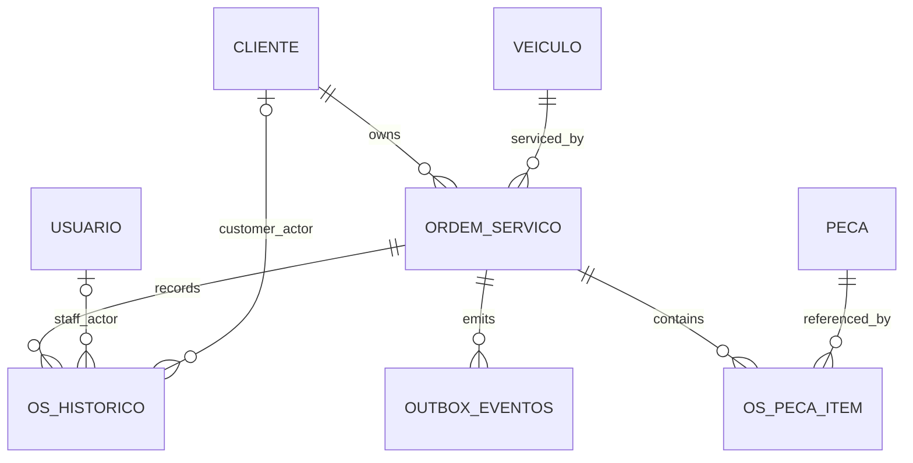

# Phase 3 — step 4A data integrity and measurement design

Status: approved by the user ("approved"), including identity-version checks, the HTTP 409 concurrency response and the first-writer-cutover interruption. Steps 1–3, [4B serverless delivery](2026-09-14-phase-3-notifications-design.md) and [4C observability](2026-09-14-phase-3-observability-design.md) are also approved. Parent: [Phase 3 specification](2026-09-14-phase-3-design.md).

## Approved data decision

Keep PostgreSQL and the four documented DDD contexts. Make focused changes to the existing aggregates and their persistence adapters:

1. Version customer authentication details so contact changes invalidate older challenges and access tokens.
2. Record staff/customer actors correctly and introduce ordered, UTC-based status history.
3. Prevent concurrent approvals and stock updates from silently overwriting each other.
4. Persist notification intent in the same database transaction as each order change.
5. Define accurate daily-order and status-duration queries, including diagnosis rework and missing historical evidence.

This adds no cloud service to the approved [AWS topology](2026-09-14-phase-3-aws-design.md). It uses the existing RDS instances and fits the previously reserved data/notification scope. New runtime queues/functions and monitoring capacity will be reviewed next.

PostgreSQL remains the business database because an order transition, part balance, audit record and notification intent need one atomic transaction, while customer/vehicle/order relationships need referential integrity. It already supports the application's JPA mappings, Flyway migrations and SQL reporting. Keeping it avoids a database conversion that would add work without serving a Phase 3 requirement. DynamoDB remains limited to the approved technical authentication state, with its own access boundary.

## Evidence from the current project

| Location | Current behavior | Required improvement |
|---|---|---|
| `Cliente`, `ClienteService`, `ClienteController` | CPF/CNPJ is normalized; email is required; only ADMIN can create/update/deactivate customers; no authentication/contact version | Preserve those staff permissions and distinguish registered contact information from demonstrated mailbox access |
| `OsHistorico`, schema V1 | `alterado_por` references `usuarios`; history time is `TIMESTAMP` without timezone | A customer UUID cannot be stored as a staff UUID; record actor type and canonical event time |
| `OrdemServico`, `Peca`, their services/repositories | Status validation and stock deduction exist; no version-based concurrency control was found | Enforce the same invariants when requests race across Kubernetes replicas |
| `EmailNotificacaoAdapter`, `OrdemServicoService` | SMTP is invoked from transactional order operations; failures are caught/logged | A notification must not describe a rolled-back change, and a committed change must leave retryable notification intent |
| `MetricasService`, `OrdemServicoRepository` | Existing real-time metric averages `finalizado_em - iniciado_em`; no duration per status | Add an explicit status-history query contract without reinterpreting the existing metric |

## Customer identity and email ownership

Add `clientes.versao_identidade BIGINT NOT NULL DEFAULT 1`, with a positive-value constraint. This is a security version, separate from the JPA row version used for concurrent writes. Increment it when the normalized CPF/document type, delivery email or active status changes. A future reactivation must also increment it. Ordinary name/address edits do not invalidate authentication unnecessarily.

Continue ADMIN-only customer enrollment and contact changes. The administrator records the intended customer's address through the existing Cadastro use case; the anonymous CPF challenge cannot select or replace that address. Audit sensitive changes with actor, customer ID, changed field names, time and previous/new identity version; omit raw CPF and email from ordinary logs. Registration does not establish legal identity or mailbox ownership by itself.

Each login challenge captures customer UUID, identity version and the registered destination selected by the trusted lookup. Successful OTP verification proves control of that mailbox for that login. **Do not introduce an `email_verificado=true` field that staff can assert or that the authentication Lambda would need to update.** This deliberately avoids another verification endpoint and preserves the approved read-only Cadastro adapter.

Extend the customer JWT with a non-sensitive integer `identity_version`. At challenge verification, reread active status and identity version; consume only the matching challenge. At resource authorization, the API compares the claim with the active customer's current version and checks ownership as already approved. The gateway validates the claim's structure but does not gain direct authority over customer records. A missing/mismatched version is an invalid customer credential (`401`). Staff tokens are unchanged by this claim.

This is an additive refinement to step 2's token contract and is included in the 4A approval. It prevents reuse of a previous mailbox's tokens after the account's identity version changes. If an administrator's change races with issuance, an already-created token can carry the old version; subsequent API authorization rejects it. The design does not claim that a distributed database/challenge-store transaction exists or that already-authorized in-flight work is retroactively cancelled.

The PostgreSQL view `auth_cliente_snapshot` exposes only customer UUID, normalized CPF, active status, registered email and identity version for the CPF flow. Restrict its login role to SELECT on that view, with no write permission or unrestricted base-table access. Keep the view/schema contract versioned by the application repository; verify permissions using the real function database role. CNPJ customers remain valid business records but cannot use the CPF login endpoint.

## Aggregate consistency under concurrent requests

Use a `versao BIGINT NOT NULL DEFAULT 0` JPA `@Version` field on `OrdemServico`, `Peca` and `Cliente`. Preserve the domain methods for transitions and stock rules. Application services coordinate transactions; persistence adapters enforce version checks. New or changed use cases must not bypass them through broad setters or bulk/native updates.

| Race or failure | Required behavior |
|---|---|
| Two customers' requests approve the same order concurrently | Exactly one transaction commits its transition, stock deduction, history and outbox event; the stale transaction rolls back |
| Two orders consume the last units of the same part | Version checks prevent a lost update; the losing transaction cannot commit a second allocation against stale stock |
| ADMIN adjusts stock while an approval consumes it | Both writers use the same part version; no silent overwrite of a concurrently committed balance |
| Customer contact edits race | One stale update fails instead of restoring an earlier email or security version |
| Any aggregate/history/outbox persistence failure | The entire order transaction rolls back; no partial stock movement or notification intent is committed |

Return `409 CONCURRENT_MODIFICATION` in the existing error envelope for stale optimistic writes. Preserve `422` for an invalid business transition or insufficient stock. A caller refreshes the resource before deciding whether to retry; do not blindly replay an approval. This new `409` response is an explicit extension to step 2C's failure contract. [Hibernate optimistic locking](https://docs.jboss.org/hibernate/orm/6.4/introduction/html_single/Hibernate_Introduction.html)

A competing insert may hit the named history-sequence uniqueness constraint before Hibernate reaches the aggregate version update. Treat that specific race as the same `409` conflict; do not broadly reclassify every integrity-constraint failure as concurrency.

Flush and handle version failures at the transaction boundary, including failures raised during commit. Multi-part orders must not trigger external side effects before that boundary. Maintain PostgreSQL's nonnegative stock/amount constraints as a second line of defense. A simple retry after a successful approval may find an invalid current transition and return `422`; there is no promise of response-level idempotency without a separately designed request-key contract.

## Ordered history and actor references

Keep `OrdemServico` as the aggregate root; history remains its child. Pass an immutable actor reference and one timestamp from an injected application `Clock` into the domain operation. Do not make the entity call Spring Security, AWS or an email client.

| Schema addition | Purpose / constraint |
|---|---|
| `os_historico.ator_tipo` and `ator_cliente_id` | Types STAFF, CUSTOMER, SYSTEM and LEGACY_UNKNOWN; customer ID references `clientes`. Retain `alterado_por` as the staff FK to `usuarios` |
| Actor CHECK constraint | STAFF requires only the staff ID; CUSTOMER requires only the customer ID; SYSTEM/LEGACY_UNKNOWN have neither. Only the migration path may assign LEGACY_UNKNOWN |
| `os_historico.ocorrido_em TIMESTAMPTZ` and `sequencia BIGINT` | Canonical event instant and increasing per-order sequence for new history; unique `(os_id, sequencia)` where sequence is present |
| `ordens_servico.sequencia_historico` and `criado_em_utc TIMESTAMPTZ` | Aggregate-owned sequence counter and canonical creation instant; optimistic locking protects competing increments |
| `historico_completo_desde_inicio` on the order | Indicates whether the full chronology is supported by evidence; new orders start complete, unresolved legacy orders do not |

A customer decision records the authenticated customer UUID, never a payload-supplied actor. A staff action records the authenticated employee UUID. Customer/staff IDs are deliberately separate foreign keys, rather than an unchecked generic UUID that loses referential integrity. System actors apply only to explicitly permitted internal operations; they do not provide a bypass for customer/staff routes.

Backfill old actor types as STAFF only where the existing staff FK is populated; use LEGACY_UNKNOWN when identity was not recorded. Never invent the customer who performed an old anonymous decision. Existing same-time history rows require a justified ordering before assigning a meaningful historical sequence; an arbitrary UUID sort is not evidence of chronology.

New events use Java `Instant` and PostgreSQL `TIMESTAMPTZ`; display dates in `America/Sao_Paulo`, and return new API timestamp fields with an explicit UTC offset. Do not overwrite legacy `criado_em` or silently reinterpret all historical timestamps. Their source timezone must be established before a backfill. The fresh AWS demonstration uses explicit-time synthetic fixtures, so importing unresolved local historical data is not a prerequisite. [PostgreSQL date/time semantics](https://www.postgresql.org/docs/16/datatype-datetime.html)

Keep existing response fields during the additive migration and document the added `ocorridoEm` field. While both representations are written, use the same clock instant and a documented compatibility timezone for legacy fields. Confirm that timezone from the existing deployment/fixture provenance; it must not be guessed from the developer workstation alone. New metric queries use only canonical fields with valid chronology.

## Durable notification intent

Add application-owned `outbox_eventos` in the same PostgreSQL database as orders. Persist a versioned integration-event snapshot through a narrow output port in the same transaction as the aggregate, history and stock change. It describes a committed transition; it is not an event-sourcing replacement for the relational model.

The row records event UUID, event type/schema version, order UUID, history sequence, event time, correlation/trace context, minimal JSON payload and publication bookkeeping. A uniqueness constraint on the transition/event identity prevents two notification intents for the same recorded transition. Payloads exclude JWTs, OTPs, CPF and free-form internal diagnostic messages; any necessary contact data stays restricted and is never copied into ordinary logs.

Replace synchronous cloud SMTP delivery in the order transaction with outbox persistence. A failed database insert rolls back the business change; an unavailable external email/queue after commit leaves durable pending work. A separate publisher can later retry it. Approved step 4B defines transport, payload/contact policy, ordering, retries, deduplication, retention and terminal failure handling. Do not claim exactly-once email delivery. [Transactional outbox rationale](https://docs.aws.amazon.com/prescriptive-guidance/latest/cloud-design-patterns/transactional-outbox.html)

This focused ER view supplements the existing complete DDD diagram; it does not replace documentation of service items, catalog relationships and customer vehicles. The full submission ER diagram must include the final schema and constraints.

## Exact business measurement definitions

All dashboard filters use the workshop's `America/Sao_Paulo` business dates, converted to UTC half-open ranges `[start, end)`. Keep calculations in seconds and format them as minutes for display. PostgreSQL history/creation records are the authoritative business source; counters emitted by several pods are not an exact daily ledger.

| Metric | Definition | Missing data behavior |
|---|---|---|
| Daily order volume | Count orders whose canonical creation instant falls on each selected business day | Show zero for a complete empty day; show legacy records excluded for unknown timestamps separately |
| Average diagnosis time | For orders delivered in the selected period, sum every completed `EM_DIAGNOSTICO` interval per order, then average those order totals | Include diagnosis rework after a refused estimate; exclude and count orders without complete valid chronology |
| Average execution time | Same delivered-order cohort; sum completed `EM_EXECUCAO` intervals per order, then average | Preserve the existing overall execution endpoint; expose this new cohort-based definition separately |
| Average finalized-to-delivery time | Same cohort; time in `FINALIZADA` until `ENTREGUE` | Label it clearly: this measures finalized-to-handover waiting, not measured mechanic labor |
| Current status age | Time since the latest valid transition for an order still in progress | Display separately from completed durations; no fabricated exit timestamp |

Use `sequencia` to order transitions and the next event's instant as the end of the previous status interval. Validate transition continuity, increasing sequence and nonnegative duration; exclude broken histories and expose their count. The common delivered-order cohort makes the three phase averages comparable and avoids treating unfinished work as zero. Show `N/A` with sample count 0 when an average has no eligible orders.

Example acceptance fixture: order A visits diagnosis for 20 minutes and then 15 minutes after an estimate refusal; it has 60 minutes of execution and 30 minutes finalized-to-delivery. Its phase totals are 35/60/30 minutes. Order B has 25/40/10 minutes. When both are delivered in the selected period, the dashboard averages must be **30/50/20 minutes**, with two orders in the sample. A still-open order does not change those averages.

Use a focused reporting/query adapter with DTO projections or explicit SQL. Do not load every order aggregate merely to build a chart, introduce another database, or add a generic CQRS framework. Expose the new aggregate reporting contract under an ADMIN-only API; monitoring tooling receives only the aggregate data it needs. Approved step 4C defines export cadence and exact dashboards.

## Indexes and migration sequence

Inspect the live database's index definitions and representative query plans before adding or dropping indexes. Initial candidates are history `(os_id, sequencia)`, order creation time for date ranges, and the due-publication columns required by the final outbox design. Existing UNIQUE constraints already create indexes on customer document, order number, vehicle plate and part code; the additional single-column indexes in V1 may be redundant. Preserve uniqueness and foreign keys. [PostgreSQL constraints and indexes](https://www.postgresql.org/docs/16/ddl-constraints.html)

1. Add new Flyway migrations after V4; do not edit already-applied V1–V4. Add nullable legacy-compatible canonical fields, version defaults, actor columns and outbox tables first.
2. Run read-only data-quality checks for document/type mismatches, timestamp provenance, missing history and duplicate/tied transitions. Backfill only what can be established; report exclusions without deleting history or inventing actors/times.
3. Test migrations on an empty PostgreSQL database and an upgraded fixture. Validate totals, foreign keys, view permissions and old/new response compatibility; keep credentials and production-like personal data out of fixtures.
4. Use a controlled first concurrency/auth cutover: finish in-flight work and replace old writer pods before accepting writes through the new versioned model, using a documented Recreate rollout for that release. Old binaries do not increment the new JPA version columns, so mixed writers would undermine the protection. This first cutover has a brief availability interruption.
5. Once all writers enforce the new contract, validate constraints and reporting indexes. Later compatible releases may use rolling deployment. Do not roll back to a pre-cutover binary that ignores identity versions or concurrency checks; choose a compatible rollback or forward fix.

## TDD acceptance before implementation is complete

1. Contact/document/status changes invalidate old challenges and customer tokens at subsequent authorization checks; a correct OTP to the current registered address works, and the function's database role cannot modify a customer.
2. Two actual concurrent database transactions prove that a duplicate approval or competing last-stock allocation cannot both commit; verify resulting stock, status, history and outbox counts after the losing transaction rolls back.
3. Staff/customer/system audit references obey the FK/CHECK rules; actor spoofing is rejected and legacy unknown actors remain honest. Clock-based tests verify canonical timestamps and ordered history.
4. A rollback produces no outbox event; a committed transition retains its event when external delivery is unavailable. Publication/delivery failure tests follow in 4B.
5. PostgreSQL fixtures prove the 30/50/20-minute example, diagnosis re-entry, empty samples, incomplete histories and business-day boundaries. Migration tests verify both fresh and upgrade paths, using the existing meaningful coverage gate rather than mocking database concurrency.

Next action (under 1 minute): open the [implementation plan](../plans/2026-09-15-phase-3-implementation.md) and choose subagent-driven or inline execution. All five design steps are approved.
